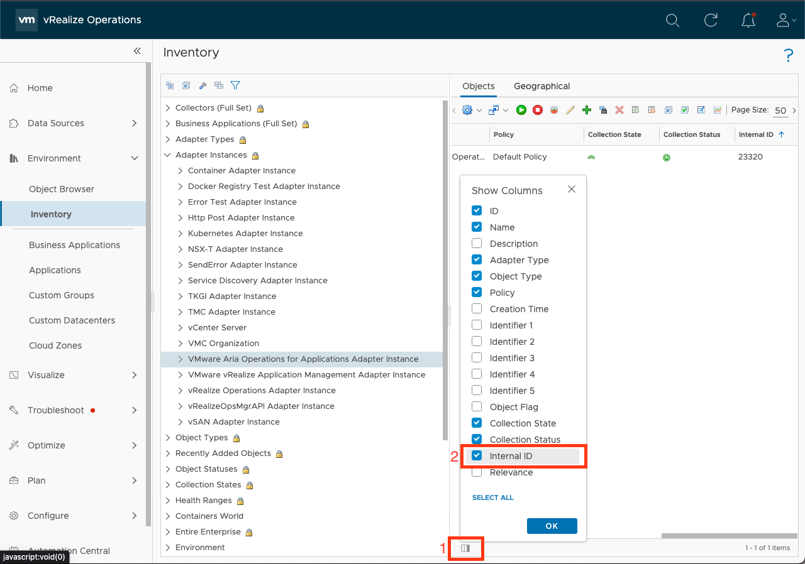

VMware Aria Operations Integration SDK
=====================

Welcome to the VMware Aria Operations Integration SDK.

## What is the Integration SDK?

The Integration SDK creates Management Packs to add custom objects, data, and
relationships from a endpoint into VMware Aria Operations.

Using this SDK to create a Management Pack requires some Python
knowledge (more languages are planned), and an understanding of how to get
data from the endpoint using an API. For example, to create a Management Pack for
Cassandra DB, an understanding of how to write an SQL query, execute it, and read the
results is required.

Currently, installing a Management Pack built with the integration SDK is supported for
On-Prem versions of VMware Aria Operations only, but we are working to bring support to
VMware Aria Operations Cloud in a future release.

For a high-level overview of VMware Aria Operations, Management Packs, and this SDK,
see [the introduction](doc/introduction.md).

## What can the Integration SDK be used for?
The Integration SDK can be used to add any endpoint that supports remote monitoring to
VMware Aria Operations. Adding the endpoint involves creating objects that
represent the endpoint, which may include properties, metrics, and events, as well as
relationships between objects.

**Remote monitoring** uses an API (such as REST, SNMP, SQL, etc) to retrieve the data (as
opposed to agent-based monitoring, where the monitoring code runs in the same location
as the endpoint).

For an example walkthrough of creating a new Management Pack monitoring an endpoint, see
[Creating a new Management Pack](#creating-a-new-management-pack)

The Integration SDK can also be used to extend objects created by another Management
Pack with additional metrics, properties, events, or relationships. This can be useful
to ensure access to custom data without having to re-implement already existing data.

For an example walkthrough of the steps required to extend another management pack, see
[Extending an Existing Management Pack](#extending-an-existing-management-pack)

## Where should I start?
* If you want to get started creating your first Management Pack, or don't know where to start, read the [Get Started](#get-started) tutorial.
* If you have completed the Get Started tutorial, the [walkthroughs](#walkthroughs) are guides for modifying your adapter.
* All documentation is available from the [contents](doc/contents.md) page.

## Get Started
<details>
<summary>This guide will walk through setting up the SDK and using the SDK
to create, test, and install a simple Management Pack (integration) onto VMware Aria Operations.</summary>

Contents
* [Requirements](#requirements)
* [Installation](#installation)
* [Creating a Management Pack](#creating-a-management-pack)
* [Testing a Management Pack](#testing-a-management-pack)
* [Building and Installing a Management Pack](#building-and-installing-a-management-pack)

### Requirements

#### Operating System:
The VMware Aria Operations Integration SDK has been tested in the following OSes:
* Windows 10
* Windows 11
* macOS 12 (Monterey)
* macOS 13 (Ventura)
* Debian Linux
* Fedora Linux

Other operating systems may be compatible.

#### VMware Aria Operations
The Management Packs generated by the VMware Aria Operations Integration SDK will only run on versions that supports containerized Management Packs. Currently, this is limited to on-prem installs, version 8.10 or later.
In addition, at least one Cloud Proxy (also version 8.10 or later) must be set up in VMware Aria Operations, as containerized Management Packs must be run on a Cloud Proxy collector.

#### Dependencies
* Docker 20.10.0 or later. Updating to the latest stable version is recommended. For instructions on installing Docker,
  go to [Docker's installation documentation](https://docs.docker.com/engine/install/), choose the OS you need and
  follow the instructions provided.
* Python3 3.9.0 or later. Updating to the latest stable version is recommended. Python 3.8 and earlier (including Python2) are not supported. For instructions on installing Python, go
  to [Python's installation documentation](https://wiki.python.org/moin/BeginnersGuide/Download), choose the OS you need
  and follow the instructions provided.
* Pip. If Python3 is installed, pip is most likely also installed. For instructions on installing Pip, go
  to [Pip's installation documentation](https://pip.pypa.io/en/stable/installation/), and follow the instructions
  provided.
* Git 2.35.0 or later. Updating to the latest stable version is recommended.
  For instructions in installing git, go to [Git's installation documentation](https://git-scm.com/downloads),
  choose the OS you need and follow the instructions provided.

[//]: # (TODO: Add this section back in once we support them)
[//]: # (#### Optional Prerequisites)
[//]: # (* Java. Java is only required for building Java Management Packs. We recommend the latest version of the [Azul Zulu SDK]&#40;https://www.azul.com/downloads/?package=jdk#download-openjdk&#41;.)
[//]: # (* Powershell. Powershell is only required for building Powershell Management Packs. See [Microsoft's installation instructions for PowerShell]&#40;https://docs.microsoft.com/en-us/powershell/scripting/install/installing-powershell?view=powershell-7.2&#41;.)
[//]: # (> Note: Creating Java and Powershell Management Packs is disabled for the Beta)

### Installation

To install the SDK, use `pip` to install into the global Python environment, or `pipx` to install into a isolated environment.
```sh
python3 -m pip install vmware-aria-operations-integration-sdk
```

### Creating a Management Pack
After the SDK is installed, create a new project, by running `mp-init`. This tool asks a series of questions that guides
the creation of a new management pack project.


1. `Enter a directory to create the project in. This is the directory where adapter code, metadata, and content will reside. If the directory doesn't already exist, it will be created. Path:`

    The path can be an absolute path, or a path relative to the directory `mp-init` was run from. The path should end in an empty
    or non-existing directory. If the directory does not exist, it will be created. This directory will contain a new Management
    Pack project.

2. `Management Pack display name`

    The Management Pack display name will show up in VMware Aria Operations (**Data Sources &rarr; Integrations &rarr;
    Repository**), or when adding an account.

    

    *This Management Pack's display name is 'TestAdapter', and uses the default icon*

3. `Management Pack adapter key`

    This field is used internally to identify the Management Pack and Adapter Kind. By default, it is set to the
    Management Pack display name with special characters and whitespace stripped from it.

4. `Management Pack description`

    This field should describe what the Management Pack will do or monitor.

5. `Management Pack vendor`

   The vendor field shows up in the UI under 'About' on the Integration Card.

   

   *This Management Pack's vendor is 'VMware'*

6. `Enter a path to a EULA text file, or leave blank for no EULA`

   VMware Aria Operations requires a EULA file to be present in a Management Pack. If one isn't provided, a stub EULA file (`eula.txt` in
   the root project directory) will be added to the project which reads:
    ```
    There is no EULA associated with this Management Pack.
    ```

7. `Enter a path to the Management Pack icon file, or leave blank for no icon`

   The icon is used in the VMware Aria Operations UI if present. If it is not present, a default icon will be used. The icon file must be
   PNG format and 256x256 pixels. An icon file can be added later by copying the icon to the root project directory and
   setting the value of the `"pak_icon"` key to the icon's file name in the `manifest.txt` file.

[//]: # (TODO: Add this section back when we support it)
[//]: # (8. `Select a language for the adapter`)
[//]: # (  selected language. The template adapter collects several objects and metrics from the container that the adapter)
[//]: # (  Once selected, the project will be generated, including a template adapter in the)
[//]: # (  is running in, and can be used as a starting point for creating a new adapter.)

For complete documentation of the `mp-init` tool including an overview of its output, see the [MP Initialization Tool Documentation](doc/mp-init.md).

### Template Project
Every new project creates a file system that has the basic project structure required to develop and build a Management Pack.
Each file and directory are discussed in depth in the [mp-init](doc/mp-init.md) documentation. `app/adapter.py` is the adapter's
entry point and the best starting point. `adapter.py` is a template adapter that collects several objects and metrics from the
container in which the adapter is running; use the template as a starting point for creating a new adapter. The template adapter
has comments throughout its code that explain what the code does and how to turn it into your adapter. The methods inside the adapter
template are required. Modify the code inside the methods to generate the desired adapter. Each method represents a single request,
and it can be tested individually using `mp-test`, which is covered in the following section. The adapter is stateless; therefore,
the adapter cannot store any data for use in later method calls. Each method is used for a different function as described below:

- test(adapter_instance):
  Performs a test connection using the information given to the adapter_instance to verify the adapter instance has been configured properly.
  A typical test connection will generally consist of:

     1. Read identifier values from adapter_instance that are required to connect to the target(s)
     2. Connect to the target(s), and retrieve some sample data
     3. If any of the above failed, return an error, otherwise pass.
     4. Disconnect cleanly from the target (ensure this happens even if an error occurs)

- get_endpoints(adapter_instance):
  This method will be run before the 'test' method, and VMware Aria Operations will use
  the results to extract a certificate from each URL. If the certificate is not trusted by
  the VMware Aria Operations Trust Store, the user will be prompted to either accept or reject
  the certificate. If it is accepted, the certificate will be added to the AdapterInstance
  object that is passed to the 'test' and 'collect' methods. Any certificate that is
  encountered in those methods should then be validated against the certificate(s)
  in the AdapterInstance. This method will not only work against HTTPS endpoints, different types
  of endpoint will not work (eg. database connections).

- collect(adapter_instance):
  Performs a collection against the target host. A typical collection will generally consist of:
    1. Read identifier values from adapter_instance that are required to connect to the target(s)
    2. Connect to the target(s), and retrieve data
    3. Add the data into a CollectResult's objects, properties, metrics, etc
    4. Disconnect cleanly from the target (ensure this happens even if an error occurs)
    5. Return the CollectResult.

- get_adapter_definition():
  Optional method that defines the Adapter Instance configuration (parameters and credentials used to connect to the target, and configure the management pack) present in a collection, and defines the object types and attribute types present in a collection. Setting these helps VMware Aria Operations to validate, process, and display the data correctly. If this method is omitted, a `describe.xml` file should be manually created inside the `conf` directory with the same data. Generally, this is only necessary when using advanced features of the `describe.xml` file that are not present in this method.


For further guidance on using the template project, consult the [Walkthroughs](../README.md#walkthroughs) section.

### Testing a Management Pack

In the Management Pack directory, the installation script writes a `requirements.txt` file containing the version of the
SDK used to generate the project, and installs the SDK into a virtual environment named `venv`. Note that the packages
in `requirements.txt` are _not_ installed into the adapter. To add a package to the adapter, specify it in the file
`adapter_requirements.txt`.

To use the SDK, navigate to the newly-generated project directory and activate the virtual environment:

For Mac and Linux:
```sh
source venv/bin/activate
```
(This script is written for the bash shell. If you use the csh or fish shells, there are alternate activate.csh and activate.fish scripts you should use instead.)
For Windows:
```cmd
venv\Scripts\activate.bat
```
To exit the virtual environment, run `deactivate` in the virtual environment.

To test a project, run `mp-test`  in the virtual environment.

If `mp-test` is run from anywhere outside of a root project directory, the tool will prompt to choose a project, and will
test the selected project. If the tool is run from a project directory, the tool will automatically test that project.

`mp-test` will ask for a _connection_. No connections should exist, so choose **New Connection**. The test tool then
reads the `conf/describe.xml` file to find the connection parameters and credentials required for a connection, and
prompts for each. This is similar to creating a new _Adapter Instance_ in the VMware Aria Operations UI. Connections are automatically
saved per project, and can be reused when re-running the `mp-test` tool.

> Note: In the template project, the only connection parameter is `ID`, and because it connects to the container it is running on, this parameter is not necessary; it is only there as an example, and can be set to any value. The template also implements an example Test Connection. If a Test Connection is run (see below), with the `ID` set to the text `bad`, then the Test Connection will fail.

The test tool also asks for the method to test. There are four options:

* Test Connection - This call tests the connection and returns either an error message if the connection failed, or an
  empty json object if the connection succeeded.
* Collect - This call test the collection, and returns objects, metrics, properties, events, and relationships.
* Endpoint URLs - This returns a list (possibly empty) of URLs that have distinct SSL certificates that VMware Aria Operations can ask
  the end user to import into the TrustStore.
* Version - This returns
  the [VMware Aria Operations Collector API](vmware_aria_operations_integration_sdk/api/vmware-aria-operations-collector-fwk2.json) version the
  adapter implements. The implementation of this method is not generally handled by the developer.

For more information on these endpoints, see
the [Swagger API documentation](vmware_aria_operations_integration_sdk/api/vmware-aria-operations-collector-fwk2.json). Each
response is validated against the API.

For complete documentation of the `mp-test` tool see the [MP Test Tool Documentation](doc/mp-test.md).

### Building and Installing a Management Pack
To build a project, run `mp-build`  in the virtual environment.

If `mp-build` is run from anywhere outside of a root project directory, the tool will prompt to choose a project, and will
build the selected project. If the tool is run from a project directory, the tool will automatically build that
project.

Once the project is selected (if necessary), the tool will build the management pack and emit a `pak` file which can be
installed on VMware Aria Operations. The `pak` file will be located in the project directory.

To install the `pak` file, in VMware Aria Operations navigate to **Data Sources &rarr; Integrations &rarr;
Repository** and click `ADD`. Select and upload the generated `pak` file, accept the README, and install the management pack.

To configure the management pack, VMware Aria Operations navigate to **Data Sources &rarr; Integrations &rarr;
Accounts** and click `ADD ACCOUNT`. Select the newly-installed management pack and configure the required fields. For
`Collector/Group`, make sure that a cloud proxy collector is selected. Click `VALIDATE CONNECTION` to test the connection.
It should return successfully, then click `ADD`.

By default, a collection will run every 5 minutes. The first collection should happen immediately, however newly-created
objects cannot have metrics, properties, and events added to them. After the second collection, approximately five
minutes later, the objects' metrics, properties, and events should appear. These can be checked by navigating to **
Environment &rarr; Object Browser &rarr; All Objects** and expanding the Adapter and associated object types and object.


*The CPU object's `idle-time` metric in a Management Pack named `QAAdapterName`.*

For complete documentation of the `mp-build` tool see the [MP Build Tool Documentation](doc/mp-build.md).
</details>

## Walkthroughs

### Creating a New Management Pack
<details><summary>
This guide assumes you have already set up the SDK and know how to create a new project. 
It walks you through the steps necessary to monitor an endpoint, using Alibaba Cloud as 
an example.</summary>


TODO
</details>

### Extending an Existing Management Pack
<details><summary>
This guide assumes you have already set up the SDK and know how to create a new project. 
It walks you through the steps necessary to extend an existing Management Pack to add
additional data, using the MySQL Management Pack as an example.</summary>

Extending an existing management pack is similar to creating a new management pack, but 
has some additional constraints. This section will create a management pack that adds 
metrics to the existing MySQL management pack's database object. It assumes
you have already installed the SDK and understand the tools and steps in the 'Get 
Started' section. It also assumes that you have installed and configured the [MySQL
management pack](https://customerconnect.vmware.com/downloads/details?downloadGroup=VRTVS_MP_MYSQL_810&productId=1051) 
on a VMware Aria Operations instance in your local network.

For the purposes of this walkthrough, we will be adding five metrics to the MySQL database
object that show the total amount of lock waits and statistics about the time spent 
waiting for those locks. This info can be found in MySQL in the table 
`performance_schema.table_lock_waits_summary_by_table`.

The first step is to run `mp-init` and create a new project. There are no restrictions,
except that the adapter kind key cannot be used by another management pack that is
installed on the same system. For example, we used the following to create the sample:

```
❯ mp-init
Enter a directory to create the project in. This is the directory where adapter code, metadata, and
content will reside. If the directory doesn't already exist, it will be created.
Path: extended-mysql-mp
Management pack display name: Extended MySQL MP
Management pack adapter key: ExtendedMySQLMP
Management pack description: Adds 'Lock Wait' metrics to MySQL Database objects
Management pack vendor: VMware, Inc
Enter a path to a EULA text file, or leave blank for no EULA: 
Enter a path to the management pack icon file, or leave blank for no icon:
An icon can be added later by setting the 'pak_icon' key in 'manifest.txt' to the
icon file name and adding the icon file to the root project directory.
Creating Project [Finished]

project generation completed
```

Once the project finished generating, we can change directory into the project 
and activate the Python virtual environment.

Next, we need to modify the adapter code. We will break this up into several steps:
1. [Add a library for connecting to MySQL](#add-a-library-for-connection-to-mysql)
2. [Modify the adapter definition to add fields for connecting to MySQL](#modify-the-adapter-definition-to-add-fields-for-connecting-to-mysql)
3. [Modify the `test` method to create a MySQL connection and run a query](#modify-the-test-method-to-create-a-mysql-connection-and-run-a-query)
4. [Modify the `collect` method to collect metrics, and attach them to the correct
   database objects](#modify-the-collect-method-to-collect-metrics-and-attach-them-to-the-correct-database-objects)
5. [Verify the MP](#verify-the-mp)

#### Add a library for connection to MySQL

In order to add the metrics we want, we will need to be able to run a query against a
MySQL database. There are several Python libraries that can help us do this. For now,
let's use [`mysql-connector-python`](https://dev.mysql.com/doc/connector-python/en/).

To add a library to the adapter, open the file `adapter_requirements.txt` and add a new
line with the name of the library. Optionally, we can also add a version constraint. 
Here's what the modified file should look like:
```
vmware-aria-operations-integration-sdk-lib==0.7.*
psutil
mysql-connector-python>=8.0.32
```

> Note: We can also remove the `psutil` library, as that is only used in the sample code 
> that we will be replacing. However, we would then no longer be able to run `mp-test` 
> until we have removed the sample code that depends on `psutil`, so for now we will 
> keep it.

#### Modify the adapter definition to add fields for connecting to MySQL

Now that we have added the library, we need to see what information it needs in order
to connect. Since the adapter will be running on the VMware Aria Operations Cloud Proxy, 
which is not where our MySQL instance is running, we will need the following:
* Host
* Port
* Username
* Password

In the `app/adapter.py` file, find the `get_adapter_definition()` method. We will define
parameters for the `Host` and `Port`, and a credential for the `Username` and `Password`.
After also removing the 'ID' parameter from the sample adapter, the method should look
similar to this:

```python
def get_adapter_definition() -> AdapterDefinition:
    logger.info("Starting 'Get Adapter Definition'")
    definition = AdapterDefinition(ADAPTER_KIND, ADAPTER_NAME)

    definition.define_string_parameter("host", "MySQL Host")
    definition.define_int_parameter("port", "Port", default=3306)

    credential = definition.define_credential_type("mysql_user", "MySQL User")
    credential.define_string_parameter("username", "Username")
    credential.define_password_parameter("password", "Password")

    # The key 'container_memory_limit' is a special key that is read by the VMware Aria 
    # Operations collector to determine how much memory to allocate to the docker 
    # container running this adapter. It does not need to be read inside the adapter 
    # code.
    definition.define_int_parameter(
        "container_memory_limit",
        label="Adapter Memory Limit (MB)",
        description="Sets the maximum amount of memory VMware Aria Operations can "
                    "allocate to the container running this adapter instance.",
        required=True,
        advanced=True,
        default=1024,
    )

    # This Adapter has no object types directly, rather it co-opts object types that
    # are part of the MySQL MP to add additional metrics. As such, we can't define
    # those object types here, because they're already defined in the MySQL MP with a
    # different adapter type.
    
    # If we decide to also create new objects (that are not part of an existing MP),
    # those can be added here.

    logger.info("Finished 'Get Adapter Definition'")
    logger.debug(f"Returning adapter definition: {definition.to_json()}")
    return definition
```

The adapter definition is also where objects and metrics are defined, however we are 
only allowed to define objects and metrics that are a part of our adapter type. Because
extensions modify objects that are part of a different adapter type, we can't add them.
This means that we can't set metric metadata like 'units', 'labels', etc that we would
generally be able to set.

#### Modify the `test` method to create a MySQL connection and run a query

Now that we've defined our parameters, we can try to connect and run a test query.
We will do this in the `test` method. Notice this takes an `AdapterInstance` as a 
parameter. We will replace all the code that is inside the try/except block.

All the parameters and credentials from the definition will be present in this Adapter 
Instance. We can access them like this, using the `key`s that we defined in the 
`get_adapter_definition` function to get the value assigned to that parameter:

```python
    hostname = adapter_instance.get_identifier_value("host")
    port = int(adapter_instance.get_identifier_value("port", "3306"))
    username = adapter_instance.get_credential_value("username")
    password = adapter_instance.get_credential_value("password")
```

We can then use them to connect to MySQL and run a test query (be sure to import 
`mysql.connector`):

```python

    connection = mysql.connector.connect(
        host=hostname,
        port=port,
        user=username,
        password=password,
    )
    cursor = connection.cursor()

    # Run a simple test query
    cursor.execute("SHOW databases")
    for database in cursor: # The cursor needs to be consumed before it is closed
        logger.info(f"Found database '{database}'")
    cursor.close()
```

Since we can expect that this will fail, e.g., if the user provides the wrong username
and password, we should ensure there is good error-handling in this function.

If we detect a failure (e.g., in the `except` block), we should call 
`result.with_error(error_message)` to indicate the test has failed. If no errors have
been attached to the `result` object, the test will pass. (Note that calling 
`result.with_error(...)` multiple times in the same test will result in only the last
error being displayed.)

If the management pack will be widely distributed, it may also be worthwhile to catch 
common errors and ensure the resulting messages are user-friendly.

We should now be able to run `mp-test connect` to run this code. The `mp-test` tool
will ask you to create a new connection, prompting for 'host', 'port', 'username', and
'password'. After, it will ask if it should override SuiteAPI<sup>1</sup> credentials. Unless you
have already set these up, select 'Yes', as we will need them later when we modify the
'collect' method. It will ask you for the SuiteAPI hostname, which should be the
hostname of the VMware Aria Operations instance where the MySQL management pack is
running, and a username and password which have permission to access to the SuiteAPI on
that system.

> <sup>1</sup>SuiteAPI is a REST API on VMware Aria Operations that can be used for many
> purposes. The documentation for this API can be found on any VMware Aria Operations
> instance at https://[aria_ops_hostname]/suite-api/. The 'adapter_instance' object that
> is passed to the 'test', 'get_endpoints', and 'collect' methods can automatically 
> connect to this API and has methods for querying it.

If everything was successful, the result should look similar to this:
```
(venv-Extended MySQL MP) ❯ mp-test connect
Choose a connection:  New Connection
Building adapter [Finished]
Waiting for adapter to start [Finished]
┌────────────────────────────────────────────────────────────────────────────────────────────────────────────────────────────────────────────┐
│Connections are akin to Adapter Instances in VMware Aria Operations, and contain the parameters                                             │
│needed to connect to a target environment. As such, the following connection parameters and credential fields are                           │
│derived from the 'conf/describe.xml' file and are specific to each Management Pack.                                                         │
└────────────────────────────────────────────────────────────────────────────────────────────────────────────────────────────────────────────┘
Enter connection parameter 'MySQL Host': mysql8-1.localnet
Enter connection parameter 'Port': 3306
Enter connection parameter 'Adapter Memory Limit (MB)': 1024
Enter credential field 'Username': root
Enter credential field 'Password': *********
Override default SuiteAPI connection information for SuiteAPI calls?  Yes
Suite API Hostname: aria-ops-1.vmware.com
Suite API User Name: admin
Suite API Password: ********
Set these as the default SuiteAPI connection?  Yes
Enter a name for this connection: default
Saved connection 'default' in '~/Code/extended-mysql-mp/config.json'.
The connection can be modified by manually editing this file.
Building adapter [Finished]
Waiting for adapter to start [Finished]
Running Endpoint URLs [Finished]
Running Connect [Finished]
{}

Avg CPU %                     | Avg Memory Usage %         | Memory Limit | Network I/O         | Block I/O
------------------------------+----------------------------+--------------+---------------------+--------------
14.9 % (0.0% / 14.9% / 29.8%) | 4.0 % (4.0% / 4.0% / 4.0%) | 1.0 GiB      | 9.06 KiB / 4.16 KiB | 0.0 B / 0.0 B

Request completed in 1.85 seconds.

All validation logs written to '~/Code/mysql-extention-mp/logs/validation.log'
Validation passed with no errors
```

#### Modify the `collect` method to collect metrics, and attach them to the correct database objects

Now that the `test` method is working, we can implement the `collect` method. This is 
the method where we query MySQL for the metrics we want and send them to VMware Aria 
Operations as part of the database objects. Before we begin writing code, we need to 
look up some information about the MySQL management pack. Specifically, we need the
following information:
* The MySQL Adapter Kind Key
* The MySQL Database Object type
* A way to create a database object that matches a database that already exists on
  VMware Aria Operations (usually the identifier list, but the name can sometimes work,
  as in this case).

These will be used to ensure that the metrics are attached to existing MySQL objects,
rather than creating new ones.
 
To get this information, we will `ssh` into the collector where the MySQL management
pack is running. Then `cd` to `$ALIVE_BASE/user/plugin/inbound/mysql_adapter3/conf/`.
From there, open the `describe.xml` file. The Adapter Kind key is at the top on the
fourth line:
```xml
<?xml version = '1.0' encoding = 'UTF-8'?>
<!-- <!DOCTYPE AdapterKind SYSTEM "describeSchema.xsd"> -->
<!-- Copyright (c) 2020 VMware Inc. All Rights Reserved. -->
<AdapterKind key="MySQLAdapter" nameKey="1" version="1" xmlns="http://schemas.vmware.com/vcops/schema">
```
Inside the `AdapterKind` tag are `ResourceKinds/ResourceKind` tags, and we can search 
for the one that represents the database resource kind. Once we have found it we can see
that it has two identifiers, one for the adapter instance ID, and one for the database 
name. 
```xml
   <ResourceKinds>
      <!-- ... -->
      <ResourceKind key="mysql_database" nameKey="64" >
          <ResourceIdentifier dispOrder="1" key="adapter_instance_id" length="" nameKey="37" required="true" type="string" identType="1" enum="false" default=""> </ResourceIdentifier>
          <ResourceIdentifier dispOrder="2" key="database_name" length="" nameKey="65" required="true" type="string" identType="1" enum="false" default=""> </ResourceIdentifier>
```
In order to attach a metric to these objects, we will need all identifiers that have an
`identType=1`. In this case, those are `adapter_instance_id` and `database_name`. This
means that the combination of those two fields uniquely identify the object among all
of the `mysql_database` objects in the `MySQLAdapter` adapter.

Getting the `adapter_instance_id` requires a SuiteAPI call. We need to retrieve the 
Adapter Instances for `MySQLAdapter` that has the same host and port identifiers as our 
adapter, and then retrieving the id. However, if we look in VMware Aria Operations 
itself, we can see that each database's name has the format `mysql_host/mysql_database`, 
which should be unique (even if VMware Aria Operations isn't using it for determining 
uniqueness). Thus, a simpler way to get matching objects (in this case) is to construct 
the name, and ask the SuiteAPI to give us all `MySQLAdapter` `mysql_database` objects 
with those names. Then we can simply attach metrics to the resulting `mysql_database` 
objects, which will have all identifiers correctly set by the SuiteAPI.

First, we should remove all the sample code inside the `try` block. All the code for the
following steps should be inside the `try` block.

Then, we need to establish a connection to MySQL. We can do this in the same way as in
test connect. In many cases creating a function for connecting that is called from both 
`test` and `collect` is worthwhile. Then we can query the list of databases, and 
construct a list of database names that may be present:

```python
        # Get the list of databases on this instance
        cursor = connection.cursor()
        cursor.execute("SHOW databases")
        database_names = [f"{hostname}/{database[0]}" for database in cursor]
        cursor.close()
```

We then query the SuiteAPI for `mysql_database` objects from the `MySQLAdapter` 
adapter, with the names we computed. The queries that `query_for_resources` accepts
are documented in the SuiteAPI documentation, and can search on many types of metadata 
about a resource. After that, we add the returned objects to the `result` and to a 
dictionary for quick access later.

```python
        # Get the list of objects from the SuiteAPI that represent the MySQL
        # databases that are on this instance, and add any we find to the result
        databases = {}  # dict of database Objects by name for easy access
        with adapter_instance.suite_api_client as suite_api:
            dbs = suite_api.query_for_resources(
                query={
                    "adapterKind": ["MySQLAdapter"],
                    "resourceKind": ["mysql_database"],
                    "name": database_names,
                },
            )
            for db in dbs:
                databases[db.get_identifier_value("database_name")] = db
                # Add each database to the collection result. Objects must be
                # added to the result in order for them to be returned by the
                # collect method.
                result.add_object(db)
```

Finally, we'll run the query to get the data from MySQL that we want, and add that data
as metrics to the relevant databases, and return the result:

```python
        # Run a query to get some additional data. Here we're getting info about
        # lock waits on each database
        cursor = connection.cursor()
        cursor.execute("""
                    select OBJECT_SCHEMA,
                           sum(COUNT_STAR)     as COUNT_STAR,
                           sum(SUM_TIMER_WAIT) as SUM_TIMER_WAIT,
                           max(MAX_TIMER_WAIT) as MAX_TIMER_WAIT,
                           min(MIN_TIMER_WAIT) as MIN_TIMER_WAIT
                    from performance_schema.table_lock_waits_summary_by_table
                    group by OBJECT_SCHEMA
                    """)

        # Iterate through the results of the query, and add them to the appropriate
        # database Object as metrics.
        for row in cursor:
            if len(row) != 5:
                logger.error(f"Row is not expected size: {repr(row)}")
                continue
            database = databases.get(row[0])
            if not database:
                logger.info(f"Database {row[0]} not found in Aria Operations")
                continue
            database.with_metric("Table Locks|Count", float(row[1]))
            database.with_metric("Table Locks|Sum", float(row[2]))
            database.with_metric("Table Locks|Max", float(row[3]))
            if float(row[1] > 0):
                database.with_metric("Table Locks|Avg", float(row[2])/float(row[1]))
            else:
                database.with_metric("Table Locks|Avg", 0)
            database.with_metric("Table Locks|Min", float(row[4]))
        cursor.close()
        
        return result
```

#### Verify the MP

To verify the MP, run `mp-test` using the same connection we created earlier. If there 
are any `mysql_database` objects that have entries in the 
`table_lock_waits_summary_by_table` table, we should see those returned in the
collection result. For example, if the MySQL management pack is configured to collect 
`loadgen`, `mysql`, and `sys`, and the data query returns:
```
object_schema      | count_star | sum_timer_wait | max_timer_wait | min_timer_wait
-------------------+------------+----------------+----------------+---------------
mysql              | 0          | 0              |0               | 0
performance_schema | 0          | 0              |0               | 0
sys                | 2          | 3946368        |2255204         | 1691164
```
Then we would expect to see entries for each database monitored by MySQL, but new
data should be present only for the subset that was also returned by the data query:
```json
{
    "nonExistingObjects": [],
    "relationships": [],
    "result": [
        {
            "events": [],
            "key": {
                "adapterKind": "MySQLAdapter",
                "identifiers": [
                    {
                        "isPartOfUniqueness": true,
                        "key": "adapter_instance_id",
                        "value": "347062"
                    },
                    {
                        "isPartOfUniqueness": true,
                        "key": "database_name",
                        "value": "loadgen"
                    }
                ],
                "name": "mysql8-1.localnet/loadgen",
                "objectKind": "mysql_database"
            },
            "metrics": [],
            "properties": []
        },
        {
            "events": [],
            "key": {
                "adapterKind": "MySQLAdapter",
                "identifiers": [
                    {
                        "isPartOfUniqueness": true,
                        "key": "adapter_instance_id",
                        "value": "347062"
                    },
                    {
                        "isPartOfUniqueness": true,
                        "key": "database_name",
                        "value": "mysql"
                    }
                ],
                "name": "mysql8-1.localnet/mysql",
                "objectKind": "mysql_database"
            },
            "metrics": [
                {
                    "key": "Table Locks|Count",
                    "numberValue": 0.0,
                    "timestamp": 1681767040181
                },
                {
                    "key": "Table Locks|Sum",
                    "numberValue": 0.0,
                    "timestamp": 1681767040181
                },
                {
                    "key": "Table Locks|Max",
                    "numberValue": 0.0,
                    "timestamp": 1681767040181
                },
                {
                    "key": "Table Locks|Avg",
                    "numberValue": 0.0,
                    "timestamp": 1681767040181
                },
                {
                    "key": "Table Locks|Min",
                    "numberValue": 0.0,
                    "timestamp": 1681767040181
                }
            ],
            "properties": []
        },
        {
            "events": [],
            "key": {
                "adapterKind": "MySQLAdapter",
                "identifiers": [
                    {
                        "isPartOfUniqueness": true,
                        "key": "adapter_instance_id",
                        "value": "347062"
                    },
                    {
                        "isPartOfUniqueness": true,
                        "key": "database_name",
                        "value": "sys"
                    }
                ],
                "name": "mysql8-1.localnet/sys",
                "objectKind": "mysql_database"
            },
            "metrics": [
                {
                    "key": "Table Locks|Count",
                    "numberValue": 2.0,
                    "timestamp": 1681767040182
                },
                {
                    "key": "Table Locks|Sum",
                    "numberValue": 3946368.0,
                    "timestamp": 1681767040182
                },
                {
                    "key": "Table Locks|Max",
                    "numberValue": 2255204.0,
                    "timestamp": 1681767040182
                },
                {
                    "key": "Table Locks|Avg",
                    "numberValue": 1973184.0,
                    "timestamp": 1681767040182
                },
                {
                    "key": "Table Locks|Min",
                    "numberValue": 1691164.0,
                    "timestamp": 1681767040182
                }
            ],
            "properties": []
        }
    ]
}
```

When everything is working as expected locally using `mp-test`, we can run
`mp-build` and install on VMware Aria Operations for a final verification.


#### Next Steps

* [Adding to an Adapter](doc/adding_to_an_adapter.md)
    * [Defining an Adapter](doc/adding_to_an_adapter.md#defining-an-adapter)
    * [Defining an Adapter Instance](doc/adding_to_an_adapter.md#defining-an-adapter-instance)
    * [Adding a Configuration Field to an Adapter Instance](doc/adding_to_an_adapter.md#adding-a-configuration-field-to-an-adapter-instance)
    * [Adding a Credential](doc/adding_to_an_adapter.md#adding-a-credential)
    * [Creating an Adapter Instance](doc/adding_to_an_adapter.md#creating-an-adapter-instance)
    * [Adding an Object Type](doc/adding_to_an_adapter.md#adding-an-object-type)
    * [Creating an Object](doc/adding_to_an_adapter.md#creating-an-object)
    * [Adding an Attribute](doc/adding_to_an_adapter.md#adding-an-attribute)
    * [Creating a Metric or Property](doc/adding_to_an_adapter.md#creating-a-metric-or-property)
    * [Creating an Event](doc/adding_to_an_adapter.md#creating-an-event)
    * [Creating a Relationship](doc/adding_to_an_adapter.md#creating-a-relationship)
* [Adding Content](doc/adding_content.md)
    * [Adding a Dashboard](doc/adding_content.md#adding-a-dashboard)
    * [Adding a Report Template](doc/adding_content.md#adding-a-report-template)
    * [Adding Alert Definitions](doc/adding_content.md#adding-alert-definitions)
    * [Adding a Traversal](doc/adding_content.md#adding-a-traversal)
    * [Adding Localization](doc/adding_content.md#adding-localization)

</details>

# Troubleshooting

<details>
  <summary><h3>Permission denied while trying to connect to the Docker daemon (Docker CLI)</h3></summary>

  If you're having trouble getting Docker to run on your system, you can refer to the Docker documentation for instructions
  on how to start Docker on [macOS](https://docs.docker.com/docker-for-mac/install/), [Linux](https://docs.docker.com/desktop/install/debian/#launch-docker-desktop), and [Windows 10 and 11](https://docs.docker.com/desktop/install/windows-install/#start-docker-desktop).
</details>

<details>
  <summary><h3>Cannot connect to Docker daemon (Docker CLI on Windows)?</h3></summary>

  If you're having trouble with permissions on a Windows system, you can refer to the Docker documentation for instructions
  on how to [Understand permission requirements for Windows](https://docs.docker.com/desktop/windows/permission-requirements/).
</details>

<details>
  <summary><h3>How can I set up an AWS container registry for my project?</h3></summary>

  AWS container registries use `aws` CLI to authenticate, so users should authenticate to their AWS container registry and create a repository before
  running `mp-build`.

  1. [Log in to your registry using aws CLI](https://docs.aws.amazon.com/AmazonECR/latest/userguide/getting-started-cli.html#cli-authenticate-registry)
  2. [Create a repository](https://docs.aws.amazon.com/AmazonECR/latest/userguide/getting-started-cli.html#cli-create-repository:~:text=your%20default%20registry-,Step%203%3A%20Create%20a%20repository,-Step%204%3A%20Push)
  3. Run `mp-build` and use the registry tag when prompted about it (usually looks like `aws_account_id.dkr.ecr.region.amazonaws.com/hello-repository`)
</details>

<details>
  <summary><h3>How can I set up a Docker Hub container registry for my project?</h3></summary>

  Docker CLI recommends using a token when using docker hub instead of your login password, so users should authenticate their Docker Hub account before running `mp-build`.

  1. Generate a [dockerhub token](https://hub.docker.com/settings/security?generateToken=true).
  2. Open the `config.json` file in the project's root directory, then replace the key-value of `docker_registry` with the tag of
  the Docker Hub repository prepended with `docker.io`. For example, if the docker tag is `username/docker-registry-test:tagname`
  then the key-value will be `docker.io/username/docker-registry-test`.

  VMware Aria Operations only supports anonymous pulling of images, which may cause issues when using Docker Hub since there is a [Donwload rate limit](https://docs.docker.com/docker-hub/download-rate-limit/#:~:text=Docker%20Hub%20limits%20the%20number,pulls%20per%206%20hour%20period).
</details>

<details>
  <summary><h3>How can I set up a Management Pack that uses a private container registry?</h3></summary>

  VMware Aria Operations only supports anonymous pulling of images, however, cloud proxies lookup images locally before attempting to pull.

  1. ssh into the cloud proxy where the adapter is going to be set up
  2. pull the same image used by the management pack (usually using the docker CLI inside the adapter)
  3. Install Management Pack in VMware Aria operations
</details>


<details>
  <summary><h3>How can change the container resgistry mp-build uses?</h3></summary>

  Open the `config.json` file located in the project's root directory, then replace the key-value for `docker_registry` with the tag of the
  repository you want to use. The next time `mp-build` is run, the new tag will be used and validated.
</details>

<details>
  <summary><h3> Where are the adapter logs stored locally?</h3></summary>

 Running `mp-test` or `mp-build` generates logs.  Logs are generated and stored in the `logs` directory.
</details>
<details>
  <summary><h3> Where are the adapter logs stored in VMware Aria Operations?</h3></summary>

  Logs are generated and stored in the cloud proxy at were the adapter was configured at `$ALIVE_BASE/user/log/adapter/<ADAPTERKEY>_adapter3/<ADAPTER_INTERNAL_INSTANCE_ID>`.

  `ADAPTERKEY` should match the name of the adapter used in the `manifest.txt`, and the `ADAPTER_INTERNAL_INSTANCE_ID` should match the Internal ID
  found in VMware Aria Operations at **Environment &rarr; Inventory &rarr; Adapter Instances &rarr; My Adapter Adapter Instance &rarr; Instance** in the rightmost column.
  The `Internal ID` column is not displayed by default. To display the Internal ID, enable the `Internal ID` column by clicking the lower left 'column' icon and then checking the `Internal ID` box.

  

  
  </details>

  <details>
    <summary><h3> What are the different types log files for?</h3></summary>

  There are five types of log files: adapter, server, build, test, and validation logs. Each log file is prepended with the type of
  log file followed by a number that represents rollover.

  - `server.log`:
  Contains all logs related to the HTTP server inside the container. Server logs can't be modified since the server code comes packaged
  inside the [base-adapter](https://projects.registry.vmware.com/harbor/projects/46752/repositories/base-adapter/artifacts-tab) Python image.

  - `adapter.log`
  Contains all logs related to the adapter. Adapter logs are all the logs generated by adapter code (e.g., the test() method or the collect() methods inside
  `app/adapter.py`).

  - `test.log`
  Contains all logs related to `mp-test`.

  - `build.log`
  Contains all logs related to `mp-build`.

  - `validation.log`
  Contains a log of the validations performed by `mp-test` on the collection results. Validation logs are only generated locally.
</details>

<details>
  <summary><h3> How do I add logs to my adapter?</h3></summary>


  The template adapter defines a logger variable in the `adapter.py` file that configures all adapter logging using [adapter_logging](https://github.com/vmware/vmware-aria-operations-integration-sdk/blob/299ce55ac0b1e53dde9c1b4b3e217ab41df57299/lib/python/src/aria/ops/adapter_logging.py) from the Python SDK.
  The logger only needs to be configured once; to generate logs in other files, simply import the Python [logging](https://docs.python.org/3/library/logging.html) module. Eg.

  ```python
  import logging

  logger = logging.getLogger(__name__)

  def my_method():
    logger.info("info log")
    logger.warning("warning log")
    logger.error("error log")
    logger.debug("debug log")
     ...
  ```
</details>


<details>
  <summary><h3> How do I change the log level (Server and Adapter)?</h3></summary>

  You can set the log levels for the server and adapter inside the `loglevels.cfg` file, which is located in `logs/loglevels.cfg` locally and in the cloud proxy at `$ALIVE_BASE/user/log/adapters/<ADAPTERKEY>_adapter3/<ADAPTER_INTERNAL_INSTANCE_ID>/loglevels.cfg`.
  If the file does not exist, the system generates it after a collection/test.

  `ADAPTERKEY` should match the name of the adapter used in the `manifest.txt`, and the `ADAPTER_INTERNAL_INSTANCE_ID` should match the Internal ID
  found in VMware Aria Operations at **Environment &rarr; Inventory &rarr; Adapter Instances &rarr; My Adapter Adapter Instance &rarr; Instance** in the rightmost column.
  To ensure Internal ID is displayed ensure the Internal ID box is enabled by clicking in the bottom left icon and then the checkbox.

  

  

</details>

<details>
  <summary><h3>Collection returns a 500 INTERNAL SERVER ERROR</h3></summary>

  Internal server errors can happen for various reasons; however, the most common cause is an unhandled exception or syntax error in
  the adapter's code. Check the server logs for clues about the issue. Sometimes, the problem may be detected using `mp-test` and
  going over the terminal output.

</details>

<details>
  <summary><h3>No collection result was found</h3></summary>

  `mp-test` runs a series of validations test after collection; if the collection has no results, then each validation step will report the result as missing.
  When a collection result is missing, it usually means an error occurred during collection, but the Adapter handled the error. When the Adapter handles an error,
  the response contains an error message; The console displays the error message. For example:

  ```python
  def collect(adapter_instance: AdapterInstance) -> CollectResult:
    result = CollectResult()
    try:
      raise Exception("oops")

      #...
    except Exception as e:
      logger.error("Unexpected collection error")
      logger.exception(e)
      result.with_error("Unexpected collection error: " + repr(e))
      return result
  ```

  This code will output

  ```
  Building adapter [Finished]
  Waiting for adapter to start [Finished]
  Running Collect [Finished]
  Collection Failed: Unexpected collection error: Exception('oops')

  Avg CPU %                     | Avg Memory Usage %         | Memory Limit | Network I/O         | Block I/O
  ------------------------------+----------------------------+--------------+---------------------+--------------
  21.1 % (0.0% / 21.1% / 42.2%) | 4.0 % (4.0% / 4.0% / 4.0%) | 1.0 GiB      | 3.24 KiB / 6.67 KiB | 0.0 B / 0.0 B

  Collection completed in 0.45 seconds.

  No collection result was found.
  No collection result was found.
  All validation logs written to '/Users/user/management-pack/test-management-pack/logs/validation.log'
  ```
  As seen above, the Exception is mentioned as the reason for the collection error, and the `No collection result was found` message is also shown.
  Using the collection error message along with the `adapter.log` can help trace the cause of the issue.
</details>

<details>
  <summary><h3>Don't see an answer to your issues?</h3></summary>

  Submit a new issue: bug report [here](https://github.com/vmware/vmware-aria-operations-integration-sdk/issues/new?assignees=&labels=bug&template=bug-report.yml).
</details>

If you encounter any issues while using the VMware Aria Operations Integration SDK tools, you
can refer to the troubleshooting guides for each tool:

- [mp-test Troubleshooting Guide](doc/mp-test.md#troubleshooting)
- [mp-init Troubleshooting Guide](doc/mp-init.md#troubleshooting)
- [mp-build Troubleshooting Guide](doc/mp-build.md#troubleshooting)

## Contributing

The vmware-aria-operations-integration-sdk project team welcomes contributions from the community. Before you start
working with this project please read and sign our Contributor License Agreement (https://cla.vmware.com/cla/1/preview).
If you wish to contribute code and you have not signed our Contributor Licence Agreement (CLA), our bot will prompt you
to do so when you open a Pull Request. For any questions about the CLA process, please refer to our
[FAQ](https://cla.vmware.com/faq).

## License

This project is licensed under the APACHE-2 License.
