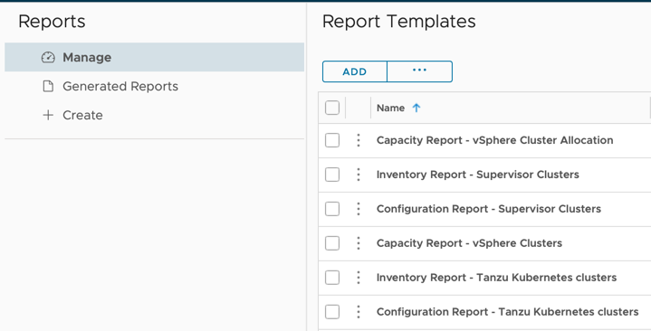

Adding Content
==============
To add content to a Management Pack, first create the adapter with the objects, metrics, properties, and relationships that are necessary for the content.
Once the adapter is ready, install the Management Pack on vROps and create an adapter instance.

Then follow the instructions below to create the content, export it, and add to the Management Pack project.

## Adding a Dashboard

1. To add a dashboard to a Management Pack, first create the dashboard. Creating a dashboard is outside the scope of this document, but more information can be found here:
   * [Dashboards (vRealize Operations documentation)](https://docs.vmware.com/en/vRealize-Operations/8.6/com.vmware.vcom.core.doc/GUID-BBEF42E2-301F-4C07-AA51-F836FECF1271.html)
   * [Create and Configure Dashboards (vRealize Operations documentation)](https://docs.vmware.com/en/vRealize-Operations/8.6/com.vmware.vcom.core.doc/GUID-0ABB810B-0496-48CF-AFC5-AA9BDF9B527A.html)
   * [vRealize Operations Dashboards Made Easy (video series)](https://www.youtube.com/watch?v=bIOgkU0kwu4)

2. Once the dashboard is created, click `Manage` on the `Visualize` &rarr; `Dashboards` page. Select the dashboard, click the `...` button, and select `Export`.

   

   
   > Note: Selecting multiple dashboards will combine them into a single dashboard.json file (see step 3). All the following steps are identical in this case, but exporting each dashboard individually is recommended as it makes managing the content easier within the Management Pack project.
    
   


3. After selecting `Export` a zip file will download with the following files and directories:
   ```
   dashboard
   ├── dashboard.json
   └── resources
       └── resources.properties
   ```
   Unzip the file and move the root `dashboard` directory to the `[project_dir]/content/dashboards` directory. The `dashboard` directory and dashboard file (`dashboard.json`) can be renamed, but should match. For example, with two dashboards, `myDashboard` and `myOtherDashboard`, the project's content directory should look like this:
   ```
   content
   ├── dashboards
   │   ├── myDashboard
   │   │   ├── myDashboard.json
   │   │   └── resources
   │   │       └── resources.properties
   │   └── myOtherDashboard
   │       ├── myOtherDashboard.json
   │       └── resources
   │           └── resources.properties
   └── <...>
   ```
4. If a dashboard uses any configuration files (Text Widget Content, Resource Kind Metrics, or Topology Widget Configurations), these are not included in the zip file. To add these to the Management Pack project, copy the necessary content from the `Configure` &rarr; `Configuration Files` page in vROps and save as a file in the `content/files/txtwidget`, `content/files/reskndmetric`, or `content/files/topowidget` directory. 
5. Once the dashboard(s) are present in the content directory as above, run `mp-build` to create a new pak file that includes the dashboards.

## Adding a Report Template

1. To add a report template to a Management Pack, first create the template. Creating a report template is outside the scope of this document, but more information can be found here:
   * [Reports (vRealize Operations documentation)](https://docs.vmware.com/en/vRealize-Operations/8.6/com.vmware.vcom.core.doc/GUID-D7C6B89F-B4D0-409F-8045-71B92FE81AFF.html)
   * [Create a Report Template (vRealize Operations documentation)](https://docs.vmware.com/en/vRealize-Operations/8.6/com.vmware.vcom.core.doc/GUID-40D426D2-92D8-4132-A695-79ED57B6683A.html)

2. Once the report template is created, click `Manage` on the `Visualize` &rarr; `reports` page. Select the report, click the `...` button, and select `Export`.

   

   
   > Note: Selecting multiple report templates will combine them into a single content.xml file (see step 3). All the following steps are identical in this case, but exporting each report individually is recommended as it makes managing the content easier within the Management Pack project. An exception is when multiple report templates share a view. In this case, best practice is to do one of three things:
   >  * Select all report templates with the shared view, so that they are combined into a single file and the view is not duplicated, or
   >  * Duplicate the view before exporting, so that each report template has its own unique view that can be modified separately.
   > 
   > The reason for this is that if a view is shared between two report templates, but is defined in multiple files, than the view could be modified in multiple places, leading to potential conflicts.

   

4. After selecting `Export` a zip file will download with the following files and directories:
   ```
   <Report_name>
   ├── content.xml
   └── resources
       └── content.properties
   ```
   Unzip the file and move the root directory to the `[project_dir]/content/reports` directory. The directory and report file (`content.xml`) can be renamed to match, if desired. For example, with two reports, `myReport` and `myOtherReport`, the project's content directory should look like this:
   ```
   content
   ├── reports
   │   ├── myReport
   │   │   ├── myReport.xml
   │   │   └── resources
   │   │       └── content.properties
   │   └── myOtherReport
   │       ├── myOtherReport.xml
   │       └── resources
   │           └── content.properties
   └── <...>
   ```
5. Once the report template(s) are present in the content directory as above, run `mp-build` to create a new pak file that includes the report templates.

## Adding Alert Definitions

1. To add an alert definition to a Management Pack, first create the alert definition. Creating an alert definition is outside the scope of this document, but more information can be found here:
   * [Configuring Alerts (vRealize Operations documentation)](https://docs.vmware.com/en/vRealize-Operations/8.6/com.vmware.vcom.core.doc/GUID-6049D9E3-57A4-443B-9334-ED336EE3BA1A.html)

2. Once the alert definition is created, click `Manage` on the `Configure` &rarr; `Alerts` &rarr; `Alert Definitions` page. Select the alerts, click the `...` button, and select `Export`.
   
 
   
   > Note: Selecting multiple alert definitions will combine them into a single xml file (see step 3). All the following steps are identical in this case, but exporting each alert individually is recommended as it makes managing the content easier within the Management Pack project. An exception is when multiple alert definitions share symptoms or recommendations. In this case, best practice is to do one of three things:
   > * Select all alert definitions with a shared dependency, so that they are combined into a single file and the dependency is not duplicated, or
   > * Move the shared dependency out of the alert definition xml file and into its own xml file, which then goes in the `content/recommendations` or `content/symptoms` directory.
   > * Duplicate the symptom or recommendation before exporting, so that each alert definition has its own unique dependency that can be modified separately.
   > 
   > The reason for this is that if a dependency is shared between two alerts, but is defined in multiple files, than the dependency could be modified in multiple places, leading to potential conflicts.
   
   

4. After selecting `Export` a zip file will download containing a single xml file that contains the alert definition and any dependent content (e.g., symptoms, recommendations)
   Unzip the file and move the alert xml file to the `[project_dir]/content/alertdefs` directory. The alert file can be renamed. For example, with two alerts, `myAlert` and `myOtherAlert`, the project's content directory should look like this:
    ```
    content
    ├── alertdefs
    │   ├── myAlert.xml
    │   └── myOtherAlert.xml
    └── <...>
    ```
5. Once the alert definition(s) are present in the content directory as above, run `mp-build` to create a new pak file that includes the alert definitions.


## Adding a Traversal

Traversals must be created manually. There is no option to create in the vROps UI and export.

## Adding Localization

The vROps UI supports translations in resource files that are included within a Management Pack.

The corresponding model element in the content file (`dashboard.json`, `describe.xml`, etc) has an identifying attribute (often `key` or `name`), which also is the default representation in the UI (a _label_).
To change this label an element, add a `nameKey` attribute in the model definition. The value of the `nameKey` attribute must be a positive integer, and corresponds to the key portion of
a key-value pair in localization resource files.

For example, to localize `total_bytes` attribute from a `describe.xml` file, first ensure there is a `nameKey` element that has a unique value:
```xml
<ResourceAttribute nameKey="182" dashboardOrder="1" key="total_bytes" dataType="integer" isProperty="false" />
```
Then, create a resource localization directory and file. The default labels are in a `resources.properties` (In the case of report templates: `content.properties`) file, which reside in a `resources` directory next to the content, and by convention is English.
```
conf
├── describe.xml
│   └── resources
│       └── resources.properties <- Default (English) resource localization file
<...>
```

The `resources.properties` file should contain all `nameKey` values and English labels:
```
version=1
1=<...>
...
181=<...>
182=Total Bytes
183=<...>
...
```
> Note: `NameKey` integers do not have to be in order or contiguous.

To supply an additional translation, create an additional file with the form `resources_<locale>.properties`, with the same set of keys as the original file but mapping to translated values.
A locale specifier can have two parts, a two-letter language ID and a two-letter country code. For example, "en_US" and "en_UK" specify American English and British English. 
The country code is optional in the resource file name. If you choose to specify the country code, it is separated from the language ID by another underscore. Do not specify a country code without a language ID.
The locale specifier uses the ISO 639-1 standard language code and ISO 3166-1 standard country code.
For example, to translate into French, add a resources file with the 'French' language code to the `resources` directory:
```
conf
├── describe.xml
│   └── resources
│       ├── resources.properties
│       └── resources_fr.properties <- French resource localization file
<...>
```
This `resources_fr.properties` file should contain all `nameKey` values in the `resources.properties` with translated values:
```
version=1
1=<...>
...
181=<...>
182=Total d'octets
183=<...>
...
```

Th
