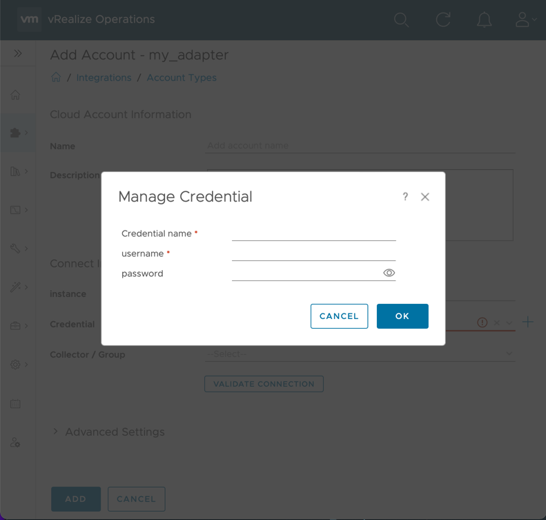
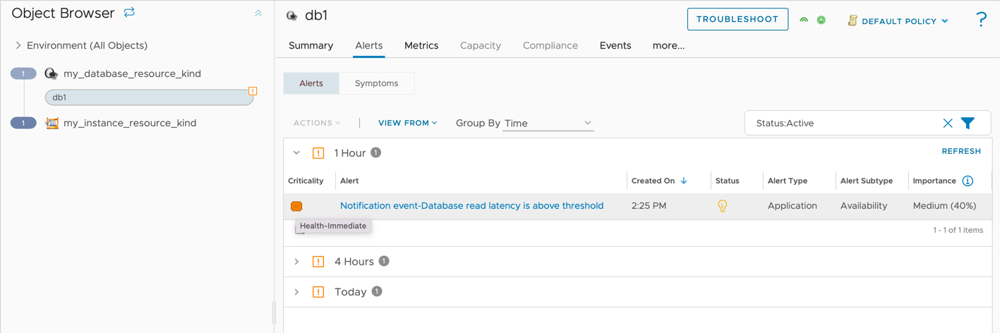

Adding to an Adapter
====================
## Defining an Adapter
To define an adapter, use the top-level `AdapterKind` element in the `conf/describe.xml` file. Only one adapter can be defined in the `describe.xml` file. The key will be used when creating objects (See [Creating an object](#Creating an Object)), and must also be present in the `manifest.txt` file in the `"adapter_kinds"` array. 

> Note: The `mp-init` tool will create the AdapterKind element and ensure its key exists in the `manifest.txt` file.

```xml
<AdapterKind xmlns="http://schemas.vmware.com/vcops/schema" key="my_adapter" nameKey="1" version="1">
    <CredentialKinds/>
    <ResourceKinds/>
    <!-- optional CapacityDefinitions, TraversalSpecKinds, etc -->
</AdapterKind>
```
For more information about the supported elements and attributes, see the [describe.xml documentation](describeSchema.xsd).

## Defining an Adapter Instance
An adapter instance is a special object in vROps that stores user configuration for a connection. Every adapter must have exactly one adapter instance. Adapter instances are set by defining a `ResourceKind` element with attribute `type=7`.
```xml
<AdapterKind xmlns="http://schemas.vmware.com/vcops/schema" key="my_adapter" nameKey="1" version="1">
  <ResourceKinds>
    <ResourceKind key="my_adapter_instance" nameKey="4" type="7" >
        <!-- ... -->
    </ResourceKind>
  </ResourceKinds>
</AdapterKind>
```

Once an adapter instance is defined, any configuration fields (`ResourceIdentifiers`) and credentials (`CredentialKind`) will be prompted to the user when creating an account in vROps on the `Data Sources` &rarr; `Integrations` page (See [Adding a Configuration Field to an Adapter Instance](#Adding a Configuration field to an Adapter Instance) and [Adding a Credential](#Adding a Credential).
After the account has been created, configuration fields will be available in the input to the `collect`, `test_connection`, and `get_endpoint_urls` methods. (See [Creating an Adapter Instance](#Creating an Adapter Instance).)

## Adding a Configuration Field to an Adapter Instance
Adapter instance _identifiers_ distinguish between adapter instances from the same adapter. They also allow for user configuration.

```xml
<AdapterKind xmlns="http://schemas.vmware.com/vcops/schema" key="my_adapter" nameKey="1" version="1">
  <ResourceKinds>
    <ResourceKind key="my_adapter_instance" nameKey="5" type="7" >
        <ResourceIdentifier dispOrder="1" key="instance" nameKey="6" required="true" type="string" identType="1"/>
        <ResourceIdentifier dispOrder="2" key="ssl_mode" nameKey="7" required="true" type="string" identType="2" enum="true">
            <enum default="true" value="Disable" />
            <enum default="false" value="Require" />
        </ResourceIdentifier>
        <ResourceIdentifier dispOrder="3" key="max_events" nameKey="8" required="false" type="integer" identType="2"/>
    </ResourceKind>
  </ResourceKinds>
  <!-- ... -->
</AdapterKind>
```
For more information about the supported elements and attributes, see the [describe.xml documentation](describeSchema.xsd).

Adapter instance identifiers can have an `identType` of `1` or `2`. A type of `1` means the identifier will be used for determining uniqueness, and will show up by default on the configuration page. If the type is `2`, the identifier is _non-identifying_, and will show up under the 'advanced' section of the configuration page.

> 
> 
> Creating an account from the above xml (plus a credential). `ssl_mode` and `max_events` have an identType of 2, so they are present in 'Advanced Settings'.

> Note: If there are any existing connections used by the [`mp-test`](mp-test.md) tool before resource identifiers were created or updated, these will need to be deleted or updated.
 
Once an adapter instance is defined, any configuration fields (`ResourceIdentifiers`) will be prompted to the user when creating an account in vROps on the `Data Sources` &rarr; `Integrations` page.
After the account has been created, configuration fields will be available in the input to the `collect`, `test_connection`, and `get_endpoint_urls` methods. (See [Creating an Adapter Instance](#Creating an Adapter Instance).)

## Adding a Credential
In order to connect to most targets a credential is required. If necessary, an adapter can have multiple different credential kinds.
To add a credential to the Adapter, add a `CredentialKind` element to `AdapterKind/CredentialKinds` in the `conf/describe.xml` file. The `CredentialKind` element takes one or more `CredentialField` elements which correspond to an individual piece of data needed for a credential. A typical credential that requires a username and password might look like this:
```xml
<AdapterKind xmlns="http://schemas.vmware.com/vcops/schema" key="my_adapter" nameKey="1" version="1">
  <CredentialKinds>
    <CredentialKind key="my_credential_type" nameKey="2" >
      <CredentialField required="true" dispOrder="0" enum="false" key="username" nameKey="3" password="false" type="string"/>
      <CredentialField required="false" dispOrder="1" enum="false" key="password" nameKey="4" password="true" type="string"/>
    </CredentialKind>
  </CredentialKinds>
  <!-- ... -->  
</AdapterKind>
```
For more information about the supported elements and attributes, see the [describe.xml documentation](describeSchema.xsd).
Once the credential is defined, it must be added to the Adapter Instance. The adapter instance is a special `ResourceKind` that is used to configure an adapter. It is marked with the xml attribute/value `type="7"`. To add the credential to the adapter instance, add an attribute `credentialKind` to the adapter instance's `ResourceKind` element, with a value of the `CredentialKind`'s `key` attribute.
```xml
<AdapterKind xmlns="http://schemas.vmware.com/vcops/schema" key="my_adapter" nameKey="1" version="1">
  <!--...-->
  <ResourceKinds>
    <ResourceKind key="my_adapter_instance" credentialKind="my_credential_type" nameKey="5" type="7" >
        <!-- ... -->
    </ResourceKind>
  </ResourceKinds>
</AdapterKind>
```
> 
> 
> Adding a credential to an adapter instance with the `username` and `password` fields as defined above. 'Credential name' is always added (by vROps), and allows for credentials to be reused between adapter instances.

In the case where multiple credential kinds are supported, the keys are separated by a comma.
```xml
<AdapterKind xmlns="http://schemas.vmware.com/vcops/schema" key="my_adapter" nameKey="1" version="1">
  <!--...-->
  <ResourceKinds>
    <ResourceKind key="my_adapter_instance" credentialKind="my_credential_type,my_other_credential_type" nameKey="5" type="7" >
        <!-- ... -->
    </ResourceKind>
  </ResourceKinds>
</AdapterKind>
```

Once the credential is defined in the `describe.xml` file, it can be used in the adapter code.
> Note: If there are any existing connections used by the [`mp-test`](mp-test.md) tool before the credential was created or updated, these will need to be deleted or updated.

Once an adapter instance is defined, any credential fields (`CredentialField`) will be prompted to the user when creating an account in vROps on the `Data Sources` &rarr; `Integrations` page.
After the account has been created, credential fields will be available in the input to the `collect`, `test_connection`, and `get_endpoint_urls` methods. (See [Creating an Adapter Instance](#Creating an Adapter Instance).)

Using the [Python vROps Integration Module](python-integration-module.md), the credential is available in the input to the `collect`, `test_connection`, and `get_endpoint_urls` methods. (See [Creating an Adapter Instance](#Creating an Adapter Instance).)

## Creating an Adapter Instance
Using the [Python vROps Integration Module](python-integration-module.md), the canonical method for creating an adapter instance is using the `AdapterInstance` object. Configuration fields and credentials can be accessed using `get_identifier_value` and `get_credential_value`, respectively. These methods return `None` if the given key does not exist in the adapter instance.

```python
adapter_instance = AdapterInstance.from_input() 

instance = adapter_instance.get_identifier_value("instance")
ssl_mode = adapter_instance.get_identifier_value("ssl_mode")
max_events = adapter_instance.get_identifier_value("max_events")

username = adapter_instance.get_credential_value("username")
password = adapter_instance.get_credential_value("password")
```
> Note: `AdapterInstance.from_input()` can only be called once per collection, test connection, or getEndpointURL invocation.

For other languages, or using Python without the vROps Integration module, json representing the adapter instance is
sent to a named pipe. The second-to-last argument the adapter is invoked with will always be the filename of the named
pipe. The adapter instance json is described in
the [vROps Collector Framework OpenAPI Document](../vrealize_operations_integration_sdk/api/vrops-collector-fwk2-openapi.json)
.

## Adding an Object Type
An object type is a class of objects (resources) that share the same set of metrics, properties, and identifiers. For example an adapter might have a 'Database' object kind, and when an adapter instance is created and connects to an application, several 'database' objects are created representing distinct databases in the application. To create a new object type, add a `ResourceKind` element inside `AdapterKind/ResourceKinds` in the `conf/describe.xml` file.
A `key` attribute is required, and must be unique among other object types within the `describe.xml` file. 

In addition, an object type may have _identifiers_, which can distinguish between objects of the same type. In the database example, we may need to know a `port` and `ip address` to uniquely identify each database. If no identifiers are specified, an object's `name` is used for determining uniqueness. If any identifiers are present (see note), then the `name` is not used for this purpose.
```xml
<AdapterKind xmlns="http://schemas.vmware.com/vcops/schema" key="my_adapter" nameKey="1" version="1">
    <!--...-->
  <ResourceKinds>
    <!--...-->
    <ResourceKind key="my_database_resource_kind" nameKey="9">
        <ResourceIdentifier dispOrder="1" key="server_ip" nameKey="10" required="true" type="string" identType="1"/>
        <ResourceIdentifier dispOrder="2" key="server_port" nameKey="11" required="true" type="integer" identType="1"/>
        <!-- ... -->
    </ResourceKind>
  </ResourceKinds>
</AdapterKind>
```
For more information about the supported elements and attributes, see the [describe.xml documentation](describeSchema.xsd).

> Note: Identifiers can have an `identType` of `1` or `2`. A type of `1` is most common, and means the identifier will be used for determining uniqueness. If the type is `2`, the identifier is _non-identifying_, and will show up in the identifiers of an object but will not cause a new object to be created if it changes. If _all_ identifiers are non-identifying, then the object's name reverts to determining uniqueness of objects. 

Once the object type is defined in the `describe.xml` file, it can be used in the adapter code. See [Creating an object](#Creating an object).

## Creating an Object
Before creating an object, ensure that the object type is [present in the describe.xml file](#Adding an object type).

Using the [Python vROps Integration Module](python-integration-module.md), the canonical method for creating a new object is to use the `CollectResult` object.

```python
result = CollectResult()
database1 = result.object(adapter_kind="my_adapter", object_kind="my_database_resource_kind", name="db1",
                          identifiers=[
                              Identifier("server_ip", "10.0.34.1"),
                              Identifier("server_port", 110)
                          ])
# <additional collection code>
# ...

# send database1 (and all other objects in the CollectResult) back to vROps
result.send_result()
```

> 
> 
> Two objects of type 'my_database_resource_kind'. The creation of the db1 object is shown above. This view is found in `Environment` &rarr; `Inventory`. By default, the identifiers are not shown. They can be enabled by clicking the menu icon in the lower left (not shown in this screenshot) and selecting the _identifier_ columns. Identifiers are ordered in ascending `dispOrder`.

For other languages, or using Python without the vROps Integration module, objects must be returned as json, described
in
the [vROps Collector Framework OpenAPI Document](../vrealize_operations_integration_sdk/api/vrops-collector-fwk2-openapi.json)
.

## Adding an Attribute
An attribute is a class of metrics or properties similar to how an object type is a class of objects. Attributes can be either a metric or property.
* A metric is numeric data that is useful to track over time. Examples: CPU Utilization (%), Used Disk Space (GB)
* A property is numeric or string data that rarely changes and only the current (last) value is relevant. Examples: Operating System Name, CPU Count

> Note: Properties should not be used for string data that has a large number of possible values. For example, if you want to have a property that shows the last time an operation was run on a server, it is better to convert that to a numeric metric such as `hours_since_last_operation`, rather than using a string property with a human-readable timestamp, as large numbers of distinct string values can degrade the performance of vROps.

Attributes can be grouped together in `ResourceGroup` elements, which can be nested. `ResourceGroups` can also be instanced.
```xml
<AdapterKind xmlns="http://schemas.vmware.com/vcops/schema" key="my_adapter" nameKey="1" version="1">
  <!--...-->
  <ResourceKinds>
    <!--...-->
    <ResourceKind key="my_database_resource_kind" nameKey="9">
      <ResourceIdentifier dispOrder="1" key="server_ip" nameKey="10" required="true" type="string" identType="1"/>
      <ResourceIdentifier dispOrder="2" key="server_port" nameKey="11" required="true" type="integer" identType="1"/>
      <ResourceGroup nameKey="4" key="tablespace">
        <ResourceAttribute nameKey="12" dashboardOrder="1" key="tablespace_name" dataType="string" isProperty="true" />
        <ResourceAttribute nameKey="13" dashboardOrder="2" key="reads" dataType="integer" isProperty="false" />
      </ResourceGroup>
      <ResourceAttribute nameKey="14" dashboardOrder="1" key="session_count" dataType="integer" isProperty="false" />
    </ResourceKind>
  </ResourceKinds>
</AdapterKind>
```
For more information about the supported elements and attributes, see the [describe.xml documentation](describeSchema.xsd).

Once an attribute is defined in the `describe.xml` file, it can be used in the adapter code. See [Creating a metric or property](#Creating a Metric or Property).

## Creating a Metric or Property
Before creating a metric or property, ensure that the attribute describing the data is [present in the describe.xml file](#Adding an Attribute).

Using the [Python vROps Integration Module](python-integration-module.md), metrics and properties can be added using the attribute key and a value. In the case of attributes in groups, the group key(s) and attribute key are separated by a pipe "|" and form the metric or property key.
```python
database1 = # Object
database1.with_property("tablespace|tablespace_name", "MyTablespace")
database1.with_metric("tablespace|reads", 104)
database1.with_metric("session_count", 5)
```

> 
> 
> Result of the above code. Since the numbers and strings are hard-coded, these values will never change. For a real adapter, the values will be the result of querying the target for up-to-date information. Note that there are a number of automatically generated metrics and properties. The metric groups 'Badge', 'vRealize Operations Generated', and 'vRealize Operations Manager Generated Properties' (and the metrics and properties inside) are present on every object.

For other languages, or using Python without the vROps Integration module, metrics and properties are returned as json
inside of objects, described in
the [vROps Collector Framework OpenAPI Document](../vrealize_operations_integration_sdk/api/vrops-collector-fwk2-openapi.json)
.

## Creating an Event
Events do not need to be declared in the `describe.xml` file, and can simply be added to an object at runtime.

Using the [Python vROps Integration Module](python-integration-module.md), events are added to resources. The only required parameter is the message, which describes and uniquely identifies the event.
```python
database1 = # Object
database1.with_event(
    message="Database read latency is above threshold", criticality=Criticality.IMMEDIATE)
```

> 
> 
> Result of the above code. Note that the criticality is affecting the health of the db1 object it is attached to.

For other languages, or using Python without the vROps Integration module, events are returned as json inside of
objects, described in
the [vROps Collector Framework OpenAPI Document](../vrealize_operations_integration_sdk/api/vrops-collector-fwk2-openapi.json)
.

## Creating a Relationship
Relationships do not need to be declared in the `describe.xml` file, and can simply be added between objects at runtime. Relationships are always between a _parent_ and _child_, and if object1 is a parent of object2, that implies object2 is a child of object1.

Using the [Python vROps Integration Module](python-integration-module.md), relationships are added to resources.
```python
instance = # Object
database1 = # Object
database2 = # Object
instance.add_child(database1)
database2.add_parent(instance) 
# database2 and database1 both have the same relationship with respect to the instance object after these calls
```

> Important: Relationships must not have cycles. A cycle happens when an object's relationships are structured in such a way that it is its own descendant (or ancestor). For example, object1 `parentOf` object2, object2 `parentOf` object3, object3 `parentOf` object1 creates a cycle. Care should be taken to avoid these, as they can adversely affect vROps' analytics calculations.

> 
> 
> Result of the above code. The db1 and db2 objects are both children of the 'instance' object. The health of a child object can impact the health of a parent object.

For other languages, or using Python without the vROps Integration module, relationships are returned as json inside a
collect result object, described in
the [vROps Collector Framework OpenAPI Document](../vrealize_operations_integration_sdk/api/vrops-collector-fwk2-openapi.json)
.
