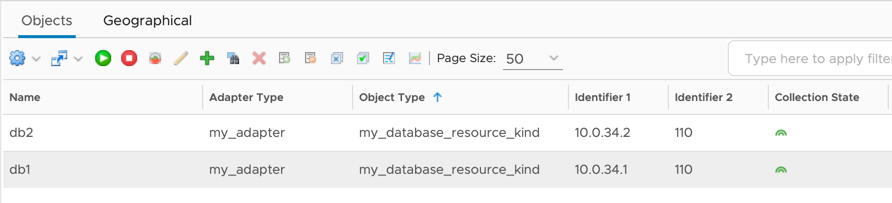

Adding to an Adapter
====================

## Object Model

### What is the Object Model?
At runtime, Aria Operations Manager creates objects representing data sources in the adapter. Every adapter must include
an object model that provides object types, object properties, and semantic definitions describing resources and the
metric data's meaning. The object model can be defined by using a `describe.xml` file, which should be defined in the
`conf` directory, or it can be defined using the [definition module](../lib/python/doc/aria/ops/definition.html)
from the [VMware Aria Operations Integration SDK Library](https://pypi.org/project/vmware-aria-operations-integration-sdk-lib/)
by defining the [AdapterDefinition](../lib/python/doc/aria/ops/definition/adapter_definition.html) object returned by
The **get_adapter_definition()** method in `app/adapter.py`.

### describe.xml Vs. AdapterDefinition?
when running `mp-build`, `mp-test collect `, or `mp-test test` they call the **get_adapter_definition** method
and then generate `describe.xml` file with the [AdapterDefinition](../lib/python/doc/aria/ops/definition/adapter_definition.html)
object. If a `describe.xml` file is present in the `conf` directory, then the object returned by the **get_adapter_definition**
method will be ignored.

## Defining an Adapter and Adapter Instance in the Object Model
To define an adapter in the `conf/describe.xml` file use the top-level `AdapterKind` element. Only one adapter can be
defined in the [object model](#defining-an-adapter-and-adapter-instance-in-the-object-model). The `key` will be used when creating objects (See [Creating an object](#creating-an-object)),
and must also be present in the `manifest.txt` file in the `"adapter_kinds"` array. When defining an adapter, we also
have to define an adapter instance. An adapter instance is a special object in VMware Aria Operations that stores user
configuration for a connection. Every adapter must have exactly one adapter instance. Adapter instances are set by
defining a `ResourceKind` element with attribute `type=7`. in Python,
we can use the [AdapterDefinition](../lib/python/doc/aria/ops/definition/adapter_definition.html).

> ### VMware Aria Operations Integration SDK Library
> ```python
> def get_adapter_definition() -> AdapterDefinition:
>     definition = AdapterDefinition("MyAdapter", "My Adapter")
> ```
>> Note: The `AdapterDefinition` will generate a describe.xml equivalent to the one below
> ### describe.xml
> ```xml
> <AdapterKind key="MyAdapter" nameKey="My Adapter" version="1" >
>     <CredentialKinds/>
>     <ResourceKinds>
>         <ResourceKind key="MyAdapter_adapter_instance" nameKey="2" type="7" credentialKind=""/>
>     </ResourceKinds>
> </AdapterKind>
> ```

For more information about the supported elements and attributes, see the [describe.xml documentation](../vmware_aria_operations_integration_sdk/adapter_template/describeSchema.xsd).
For more information about the Python module visit [VMware Aria Operations Integration SDK Library](https://pypi.org/project/vmware-aria-operations-integration-sdk-lib/).

Once an adapter instance is defined, any configuration fields (`ResourceIdentifiers` element) and credentials (`CredentialKind` element)
will be prompted to the user when creating an account in VMware Aria Operations on the `Data Sources` &rarr; `Integrations`
page (See [Adding a Configuration Field to an Adapter Instance](#adding-a-configuration-field-to-an-adapter-instance)
and [Adding a Credential](#adding-a-credential). After the account has been created, configuration fields will be
available in the input to the `collect`, `test`, and `get_endpoint` methods.
(See [Creating an Adapter Instance](#creating-an-adapter-instance).)

## Adding a Configuration Field to an Adapter Instance in the Object Model
Adapter instance _identifiers_ distinguish between adapter instances from the same adapter. They also allow for user configuration.

> ### VMware Aria Operations Integration SDK Library
> ```python
> def get_adapter_definition() -> AdapterDefinition:
>     definition = AdapterDefinition("MyAdapter", "My Adapter")
>
>     definition.define_string_parameter(
>         "instance",
>         label="Instance",
>         required=True,
>     )
>     definition.define_enum_parameter(
>         "ssl_mode",
>         values= ["Disable"],
>         label="SSL",
>         default="Require",
>         advanced=True,
>     )
>     definition.define_int_parameter(
>         "max_events",
>         label="Max Events",
>         advanced=True,
>     )
> ```
> The `AdapterDefinition` will generate a describe.xml equivalent to the one below
> ### describe.xml
> ```xml
> <AdapterKind xmlns="http://schemas.vmware.com/vcops/schema" key="My Adapter" nameKey="1" version="1">
>   <ResourceKinds>
>     <ResourceKind key="MyAdapter_adapter_instance" nameKey="5" type="7" >
>         <ResourceIdentifier dispOrder="1" key="instance" nameKey="6" required="true" type="string" identType="1"/>
>         <ResourceIdentifier dispOrder="2" key="ssl_mode" nameKey="7" required="true" type="string" identType="2" enum="true">
>             <enum default="true" value="Disable" />
>             <enum default="false" value="Require" />
>         </ResourceIdentifier>
>         <ResourceIdentifier dispOrder="3" key="max_events" nameKey="8" required="false" type="integer" identType="2"/>
>     </ResourceKind>
>   </ResourceKinds>
>   <!-- ... -->
> </AdapterKind>
> ```
For more information about the supported elements and attributes, see the [describe.xml documentation](../vmware_aria_operations_integration_sdk/adapter_template/describeSchema.xsd).
For more information about the Python module visit [VMware Aria Operations Integration SDK Library](https://pypi.org/project/vmware-aria-operations-integration-sdk-lib/).

In the `describe.xml` adapter instance identifiers can have an `identType` of `1` or `2`. A type of `1` means the
identifier will be used for determining uniqueness, and will show up by default on the configuration page. If the type
is `2`, the identifier is _non-identifying_, and will show up under the 'advanced' section of the configuration page.
In Python, the [Parameter](../lib/python/doc/aria/ops/definition/parameter.html) object has an `adavanced` attribute that determines
identType.


> 
>
> Creating an account from the above xml (plus a credential). `ssl_mode` and `max_events` have an identType of 2, so they are present in 'Advanced Settings'.

> Note: If there are any existing connections used by the [`mp-test`](mp-test.md) tool before resource identifiers were created or updated, these will need to be deleted or updated.

Once an adapter instance is defined, any configuration fields (`ResourceIdentifiers`) will be prompted to the user when
creating an account in VMware Aria Operations on the `Data Sources` &rarr; `Integrations` page.
After the account has been created, configuration fields will be available to the `AdapterInstance` object passed to the
`collect`, `test`, and `get_endpoints` methods defined in `adapter.py`. (See [Creating an Adapter Instance](#creating-an-adapter-instance).)


## Defining a Credential in the Object Model
In order to connect to most targets a credential is required. If necessary, an adapter can have multiple different credential kinds.
To add a credential to the Adapter using in the `conf/describe.xml`, add a `CredentialKind` element to `AdapterKind/CredentialKinds`.
The `CredentialKind` element takes one or more `CredentialField` elements which correspond to an individual piece
of data needed for a credential. In Python, we can use the `AdapterDefinition.define_credential_type` function
to define a new credential type and add it to the `AdapterDefinition` object; then we can specify each credential
field using the returned [CredentialType](../lib/python/doc/src/aria/ops/definition/credential_type.html).
A typical credential that requires a username and password might look like this:

> ### VMware Aria Operations Integration SDK Library
> ```python
> def get_adapter_definition() -> AdapterDefinition:
>     definition = AdapterDefinition("MyAdapter", "My Adapter")
>
>     credential = definition.define_credential_type("my_credential_type", "Credential")
>     credential.define_string_parameter("user_name", "User Name")
>     credential.define_password_parameter("user_password", "Password", required=False)
> ```
> The `AdapterDefinition` will generate a describe.xml equivalent to the one below
> ### describe.xml
> ```xml
> <AdapterKind xmlns="http://schemas.vmware.com/vcops/schema" key="my_adapter" nameKey="1" version="1">
>   <CredentialKinds>
>     <CredentialKind key="my_credential_type" nameKey="2" >
>       <CredentialField required="true" dispOrder="0" enum="false" key="user_name" nameKey="3" password="false" type="string"/>
>       <CredentialField required="false" dispOrder="1" enum="false" key="user_password" nameKey="4" password="true" type="string"/>
>     </CredentialKind>
>   </CredentialKinds>
>   <!-- ... -->
> </AdapterKind>
> ```
For more information about the supported elements and attributes, see the [describe.xml documentation](../vmware_aria_operations_integration_sdk/adapter_template/describeSchema.xsd).
For more information about the Python module visit [VMware Aria Operations Integration SDK Library](https://pypi.org/project/vmware-aria-operations-integration-sdk-lib/).

When defining a credential in `conf/describe.xml` file, it must be added to the Adapter Instance. The adapter
instance is a special `ResourceKind` that is used to configure an adapter. It is marked with the xml attribute/value
`type="7"`. To add the credential to the adapter instance, add an attribute `credentialKind` to the adapter instance's
`ResourceKind` element, with a value of the `CredentialKind`'s `key` attribute.

### describe.xml
```xml
<AdapterKind xmlns="http://schemas.vmware.com/vcops/schema" key="my_adapter" nameKey="1" version="1">
  <!--...-->
  <ResourceKinds>
    <ResourceKind key="my_adapter_instance" credentialKind="my_credential_type" nameKey="5" type="7" >
        <!-- ... -->
    </ResourceKind>
  </ResourceKinds>
</AdapterKind>
```

> 
>
> Adding a credential to an adapter instance with the `username` and `password` fields as defined above. 'Credential name'
> is always added (by VMware Aria Operations), and allows for credentials to be reused between adapter instances.

Both `describe.xml` and [AdapterDefinition](../lib/python/doc/aria/ops/definition/adapter_definition.html) allow for the
use of multiple credential.

> ### VMware Aria Operations Integration SDK library
> ```python
> def get_adapter_definition() -> AdapterDefinition:
>     definition = AdapterDefinition("MyAdapter", "My Adapter")
>
>     credential = definition.define_credential_type("my_credential_type", "Credential")
>     credential.define_string_parameter("user_name", "User Name")
>     credential.define_password_parameter("user_password", "Password", required=False)
>     # Second set of credentials
>     second_credential = definition.define_credential_type("my_second_credential_type", "Second Credential")
>     second_credential.define_string_parameter("second_user_name", "Second User Name")
>     second_credential.define_password_parameter("second_user_password", "Second Password", required=False)
> ```
>> Note: The `AdapterDefinition` will generate a describe.xml equivalent to the one below
> ### describe.xml
> ```xml
> <AdapterKind xmlns="http://schemas.vmware.com/vcops/schema" key="my_adapter" nameKey="1" version="1">
>   <CredentialKinds>
>       <CredentialKind key="my_credential_type" nameKey="2" >
>         <CredentialField required="true" dispOrder="0" enum="false" key="user_name" nameKey="3" password="false" type="string"/>
>         <CredentialField required="false" dispOrder="1" enum="false" key="user_password" nameKey="4" password="true" type="string"/>
>       </CredentialKind>
>       <CredentialKind key="my_second_credential_type" nameKey="2" >
>           <CredentialField required="true" dispOrder="0" enum="false" key="second_user_name" nameKey="3" password="false" type="string"/>
>           <CredentialField required="false" dispOrder="1" enum="false" key="second_user_password" nameKey="4" password="true" type="string"/>
>       </CredentialKind>
>   </CredentialKinds>
>   <ResourceKinds>
>       <ResourceKind key="MyAdapter_adapter_instance" nameKey="2" type="7" credentialKind="my_credential_type,my_second_credential_type"/>
>   </ResourceKinds>
> </AdapterKind>
> ```
>> In the describe.xml credential kind keys are separated by a comma.

Once the credential is defined in the [object model](#defining-an-adapter-and-adapter-instance-in-the-object-model), it can be used in the adapter code.
> Note: If there are any existing connections used by the [`mp-test`](mp-test.md) tool before the credential was created
> or updated, these will need to be deleted or updated.

Once an adapter instance is defined, any credential defined in the [object model](#defining-an-adapter-and-adapter-instance-in-the-object-model)
will be prompted to the user when creating an account in VMware Aria Operations on the `Data Sources` &rarr; `Integrations`
page. After the account has been created, credential fields will be available `AdapterInstance` object passed to the
`collect`, `test`, and `get_endpoints` methods.(See [Creating an Adapter Instance](#creating-an-adapter-instance).)

Using the [VMware Aria Operations Integration SDK library](https://pypi.org/project/vmware-aria-operations-integration-sdk-lib/),
the credential is available in the [AdapterInstance](../lib/python/doc/aria/ops/adapter_instance.html) object passed to
the `collect`, `test`, and `get_endpoint` methods in `app/adapter.py` .(See [Creating an Adapter Instance](#creating-an-adapter-instance).)

## Creating an Adapter Instance
Using the [VMware Aria Operations Integration SDK library](https://pypi.org/project/vmware-aria-operations-integration-sdk-lib/),
the canonical method for creating an adapter instance is using the `AdapterInstance` object. Configuration fields and
credentials can be accessed using `get_identifier_value` and `get_credential_value`, respectively. These methods return
`None` if the given key does not exist in the adapter instance.

```python
adapter_instance = AdapterInstance.from_input()

instance = adapter_instance.get_identifier_value("instance")
ssl_mode = adapter_instance.get_identifier_value("ssl_mode")
max_events = adapter_instance.get_identifier_value("max_events")

username = adapter_instance.get_credential_value("username")
password = adapter_instance.get_credential_value("password")
```
> Note: `AdapterInstance.from_input()` can only be called once per collection, test connection, or getEndpointURL invocation.

For other languages, or using Python without the VMware Aria Operations Integration SDK Library module, JSON representing
the adapter instance is sent to a named pipe. The second-to-last argument the adapter is invoked with will always be the
filename of the named pipe.

## Adding an Object Type to the Object Model
An object type is a class of objects (resources) that share the same set of metrics, properties, and identifiers. For
example an adapter might have a 'Database' object kind, and when an adapter instance is created and connects to an
application, several 'database' objects are created representing distinct databases in the application.
To create a new object type in the `conf/describe.xml` file, add a `ResourceKind` element inside `AdapterKind/ResourceKinds`.
A `key` attribute is required, and must be unique among other object types within the `describe.xml` file.
To create a new object type using the [VMware Aria Operations Integration SDK library](https://pypi.org/project/vmware-aria-operations-integration-sdk-lib/)
use the `AdapterDefinition.define_object_type` function of [AdapterDefinition](../lib/python/doc/aria/ops/definition/adapter_definition.html) object.

> ### VMware Aria Operations Integration SDK Library
> ```python
> def get_adapter_definition() -> AdapterDefinition:
>     definition = AdapterDefinition("MyAdapter", "My Adapter")
>
>     definition.define_object_type("my_database_resource_kind", "Data Base")
> ```
> The `AdapterDefinition` will generate a describe.xml equivalent to the one below
> ### describe.xml
> ```xml
> <AdapterKind xmlns="http://schemas.vmware.com/vcops/schema" key="my_adapter" nameKey="1" version="1">
>     <!--...-->
>   <ResourceKinds>
>     <!--...-->
>     <ResourceKind key="my_database_resource_kind" nameKey="9"/>
>   </ResourceKinds>
> </AdapterKind>
> ```

In addition, an object type may have _identifiers_, which can distinguish between objects of the same type. In the database
example, we may need to know a `port` and `ip address` to uniquely identify each database. If no identifiers are specified,
an object's `name` is used for determining uniqueness. If any identifiers are present (see note), then the `name` is
not used for this purpose.

> ### VMware Aria Operations Integration SDK Library
> ```python
> def get_adapter_definition() -> AdapterDefinition:
>     definition = AdapterDefinition("MyAdapter", "My Adapter")
>
>     data_base = definition.define_object_type("my_database_resource_kind", "Data Base")
>     data_base.define_string_identifier("server_ip", "IP")
>     data_base.define_string_identifier("server_port", "Port")
> ```
> The `AdapterDefinition` will generate a describe.xml equivalent to the one below
> ### describe.xml
> ```xml
> <AdapterKind xmlns="http://schemas.vmware.com/vcops/schema" key="my_adapter" nameKey="1" version="1">
>     <!--...-->
>   <ResourceKinds>
>     <!--...-->
>     <ResourceKind key="my_database_resource_kind" nameKey="9">
>         <ResourceIdentifier dispOrder="1" key="server_ip" nameKey="10" required="true" type="string" identType="1"/>
>         <ResourceIdentifier dispOrder="2" key="server_port" nameKey="11" required="true" type="integer" identType="1"/>
>         <!-- ... -->
>     </ResourceKind>
>   </ResourceKinds>
> </AdapterKind>
> ```

> Note: 'ResourceIdentifier' element can have an `identType` of `1` or `2`. A type of `1` is most common, and means the
> identifier will be used for determining uniqueness. If the type is `2`, the identifier is _non-identifying_, and will
> show up in the identifiers of an object but will not cause a new object to be created if it changes. If _all_
> identifiers are non-identifying, then the object's name reverts to determining uniqueness of objects. When using
> [VMware Aria Operations Integration SDK Library](https://pypi.org/project/vmware-aria-operations-integration-sdk-lib/)
> the **define_string_identifier** accepts a `is_part_of_uniqueness` parameter, which is True by default.

For more information about the supported elements and attributes, see the [describe.xml documentation](../vmware_aria_operations_integration_sdk/adapter_template/describeSchema.xsd).
For more information about the Python module visit [VMware Aria Operations Integration SDK Library](https://pypi.org/project/vmware-aria-operations-integration-sdk-lib/).

Once the object type is defined in the [object model](#defining-an-adapter-and-adapter-instance-in-the-object-model),
it can be used in the adapter code. See [Creating an object](#creating-an-object).

## Creating an Object
Before creating an object, ensure that the object type is [present in the object model](#adding-an-object-type).

Using the [VMware Aria Operations Integration SDK library](https://pypi.org/project/vmware-aria-operations-integration-sdk-lib/),
the canonical method for creating a new object is to use the `CollectResult` object.

```python
result = CollectResult()
database1 = result.object(adapter_kind="my_adapter", object_kind="my_database_resource_kind", name="db1",
                          identifiers=[
                              Identifier("server_ip", "10.0.34.1"),
                              Identifier("server_port", 110)
                          ])
# <additional collection code>
# ...

# send database1 (and all other objects in the CollectResult) back to VMware Aria Operations
result.send_result()
```

> 
>
> Two objects of type 'my_database_resource_kind'. The creation of the db1 object is shown above. This view is found in `Environment` &rarr; `Inventory`. By default, the identifiers are not shown. They can be enabled by clicking the menu icon in the lower left (not shown in this screenshot) and selecting the _identifier_ columns. Identifiers are ordered in ascending `dispOrder`.

For other languages, or using Python without the VMware Aria Operations Integration module, objects must be returned as json, described
in
the [VMware Aria Operations Collector Framework OpenAPI Document](../vmware_aria_operations_integration_sdk/api/vmware-aria-operations-collector-fwk2.json)
.

## Defining an Attribute in the Object Model
An attribute is a class of metrics or properties similar to how an object type is a class of objects. Attributes can be
either a metric or property.
* A metric is numeric data that is useful to track over time. Examples: CPU Utilization (%), Used Disk Space (GB)
* A property is numeric or string data that rarely changes and only the current (last) value is relevant. Examples:
  Operating System Name, CPU Count

> Note: Properties should not be used for string data that has a large number of possible values. For example, if you
> want to have a property that shows the last time an operation was run on a server, it is better to convert that
> to a numeric metric such as `hours_since_last_operation`, rather than using a string property with a human-readable
> timestamp, as large numbers of distinct string values can degrade the performance of VMware Aria Operations.

in the `conf/describe.xml` file, attributes can be grouped together in `ResourceGroup` elements, which can be nested.
`ResourceGroups` can also be instanced.

> ### VMware Aria Operations Integration SDK Library
> ```python
> def get_adapter_definition() -> AdapterDefinition:
>     definition = AdapterDefinition("MyAdapter", "My Adapter")
>
>     data_base = definition.define_object_type("my_database_resource_kind", "Data Base")
>     data_base.define_string_identifier("server_ip", "IP")
>     data_base.define_string_identifier("server_port", "Port")
>
>     table_space_group = data_base.define_group("tablespace", "Tablespace")
>     table_space_group.define_string_property("tablespace_name", "Name")
>     table_space_group.define_metric("reads", "Reads")
>
>     data_base.define_metric("session_count", "Sessions")
> ```
> The `AdapterDefinition` will generate a describe.xml equivalent to the one below
> ### describe.xml
> ```xml
> <AdapterKind xmlns="http://schemas.vmware.com/vcops/schema" key="my_adapter" nameKey="1" version="1">
>   <!--...-->
>   <ResourceKinds>
>     <!--...-->
>     <ResourceKind key="my_database_resource_kind" nameKey="9">
>       <ResourceIdentifier dispOrder="1" key="server_ip" nameKey="10" required="true" type="string" identType="1"/>
>       <ResourceIdentifier dispOrder="2" key="server_port" nameKey="11" required="true" type="integer" identType="1"/>
>       <ResourceGroup nameKey="4" key="tablespace">
>         <ResourceAttribute nameKey="12" dashboardOrder="1" key="tablespace_name" dataType="string" isProperty="true" />
>         <ResourceAttribute nameKey="13" dashboardOrder="2" key="reads" dataType="integer" isProperty="false" />
>       </ResourceGroup>
>       <ResourceAttribute nameKey="14" dashboardOrder="1" key="session_count" dataType="integer" isProperty="false" />
>     </ResourceKind>
>   </ResourceKinds>
> </AdapterKind>
> ```
For more information about the supported elements and attributes, see the [describe.xml documentation](../vmware_aria_operations_integration_sdk/adapter_template/describeSchema.xsd).
For more information about the Python module visit [VMware Aria Operations Integration SDK Library](https://pypi.org/project/vmware-aria-operations-integration-sdk-lib/).
Once an attribute is defined in the [object model](#defining-an-adapter-and-adapter-instance-in-the-object-model), it can be used in the adapter code. See [Creating a metric or property](#creating-a-metric-or-property).

## Creating a Metric or Property
Before creating a metric or property, ensure that the attribute describing the data is [present in the object model](#adding-an-attribute).

Using the [VMware Aria Operations Integration SDK library](https://pypi.org/project/vmware-aria-operations-integration-sdk-lib/)
, metrics and properties can be added using the attribute key and a value. In the case of attributes in groups, the
group key(s) and attribute key are separated by a pipe "|" and form the metric or property key.

```python
database1 = # Object
database1.with_property("tablespace|tablespace_name", "MyTablespace")
database1.with_metric("tablespace|reads", 104)
database1.with_metric("session_count", 5)
```

> 
>
> Result of the above code. Since the numbers and strings are hard-coded, these values will never change.
> For a real adapter, the values will be the result of querying the target for up-to-date information.
> Note that there are a number of automatically generated metrics and properties. The metric groups 'Badge',
> 'vRealize Operations Generated', and 'vRealize Operations Manager Generated Properties' (and the metrics
> and properties inside) are present on every object.

For other languages, or using Python without the VMware Aria Operations Integration module, metrics and properties
are returned as json inside of objects, described in the
[VMware Aria Operations Collector Framework OpenAPI Document](../vmware_aria_operations_integration_sdk/api/vmware-aria-operations-collector-fwk2.json).

## Creating an Event
Events do not need to be declared in the [object model](#defining-an-adapter-and-adapter-instance-in-the-object-model) file, and can simply be added to an object at runtime.

Using the [VMware Aria Operations Integration SDK library](https://pypi.org/project/vmware-aria-operations-integration-sdk-lib/)
, events are added to resources. The only required parameter is the message, which describes and uniquely identifies the event.

```python
database1 = # Object
database1.with_event(
    message="Database read latency is above threshold", criticality=Criticality.IMMEDIATE)
```

> 
>
> Result of the above code. Note that the criticality is affecting the health of the db1 object it is attached to.

For other languages, or using Python without the VMware Aria Operations Integration SDK Library module, events are
returned as json inside of objects, described in the
[VMware Aria Operations Collector Framework OpenAPI Document](../vmware_aria_operations_integration_sdk/api/vmware-aria-operations-collector-fwk2.json)
.

## Creating a Relationship
Relationships do not need to be declared in the [object model](#defining-an-adapter-and-adapter-instance-in-the-object-model) file, and can simply be added between objects at runtime.
Relationships are always between a _parent_ and _child_, and if object1 is a parent of object2, that implies object2
is a child of object1.

Using the [VMware Aria Operations Integration SDK library](https://pypi.org/project/vmware-aria-operations-integration-sdk-lib/)
, relationships are added to resources.
```python
instance = # Object
database1 = # Object
database2 = # Object
instance.add_child(database1)
database2.add_parent(instance)
# database2 and database1 both have the same relationship with respect to the instance object after these calls
```

> Important: Relationships must not have cycles. A cycle happens when an object's relationships are structured in such a
> way that it is its own descendant (or ancestor). For example, object1 `parentOf` object2, object2 `parentOf` object3,
> object3 `parentOf` object1 creates a cycle. Care should be taken to avoid these, as they can adversely affect
> VMware Aria Operations' analytics calculations.

> 
>
> Result of the above code. The db1 and db2 objects are both children of the 'instance' object. The health of a child
> object can impact the health of a parent object.

For other languages, or using Python without the VMware Aria Operations Integration module, relationships are returned as json inside a
collect result object, described in
the [VMware Aria Operations Collector Framework OpenAPI Document](../vmware_aria_operations_integration_sdk/api/vmware-aria-operations-collector-fwk2.json)
.
