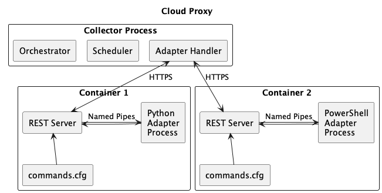

Architecture
============

This section describes how a Management Pack works, and how it interacts with the VMware 
Aria Operations Collector.

## Management Pack
A management pack consists of content, metadata, and an adapter.

* Content includes [Dashboards](./adding_content.md#adding-a-dashboard), 
  [Reports](./adding_content.md#adding-a-report-template), 
  [Symptoms and Alerts](./adding_content.md#adding-alert-definitions), 
  [Traversals](./adding_content.md#adding-a-traversal), and
  [Localization](./adding_content.md#adding-localization).
* Metadata includes the `describe.xml` file that describes an adapter, and the 
  `manifest.txt` file that describes the management pack as a whole.
* The Adapter is a container that performs the collection and sends the data to 
  VMware Aria Operations. The adapter container image consists of two parts:
  * The Adapter/Collection code. This is the portion written by the SDK developer.
  * A REST server specified by [Collector Framework 2](../vmware_aria_operations_integration_sdk/api/vmware-aria-operations-collector-fwk2.json),
    which handles communication between the collection code and the VMware Aria 
    Operations collector process.

> 
> 
> A Cloud Proxy collector process managing adapter containers, which each correspond to
> one adapter instance. Within each container is the REST server and the adapter 
> process. The [Commands.cfg](#commandscfg) file tells the REST server how to run the
> adapter process for each endpoint.
 
### Adapter/Collection Code
The Collection code is the main user-written code. It provides three functions:
* 'Test': Determines if connection information entered by a user is valid.
* 'Collect': Collect data from an external source and format it into an object structure 
   which VMware Aria Operations can understand.
* 'Get Endpoints': If the connection to the external source uses HTTPS, this method can
   be used to tell VMware Aria Operations where to find certificates, and if they are
   not signed by a Certificate Authority, present them to the user.
Optionally, the adapter can provide a fourth method:
* 'Definition': If present, this is used by `mp-build` and `mp-test` to 
   generate a `describe.xml` file. Otherwise, a `describe.xml` file must be manually
   created. 

### Rest Server
The REST server specified by [Collector Framework 2](../vmware_aria_operations_integration_sdk/api/vmware-aria-operations-collector-fwk2.json),
handles communication between the collection code and the VMware Aria Operations 
collector process. The SDK includes a base container image that includes a REST 
server. In the adapter's dockerfile, this is specified in the 'FROM' directive on the 
first line. For example, the following line Dockerfile creates an adapter using the
`0.10.3` version of the Server:
```
FROM projects.registry.vmware.com/vmware_aria_operations_integration_sdk/base-adapter:python-0.10.3

COPY adapter_requirements.txt .
RUN pip3 install -r adapter_requirements.txt

COPY commands.cfg .
COPY app app
```

This server implements all the required endpoints, provides error handling, and adds 
some additional context to the user code that is not present in the original REST 
requests. The server also adds a [definition endpoint](../vmware_aria_operations_integration_sdk/api/integration-sdk-definition-endpoint.json)
which allows the collection code to describe itself, rather than requiring a 
`describe.xml` file to be manually created, and some features that improve the debugging
experience.

#### Rest Server Collection Sequence
When performing a collection, test connection, definition, or get endpoints request,
the following sequence takes place:
1. VMware Aria Operations Collector sends request to adapter.
2. Server reads `commands.cfg` to determine how to handle the request.
3. Server starts a subprocess with the command and arguments from `commands.cfg`, plus
   the input and output named pipe arguments.
4. Server writes the request payload to 'input' named pipe.
5. Server waits for subprocess to complete and write its response to the 'output'
   named pipe, then reads the result.
6. Server processes the result and sends it as a response to the original REST request.
7. If any steps failed, clean up and send an appropriate error message as REST request
   response.

Note: The `mp-test` tool by default has a timeout of 5 minutes for each REST request.
This is different than the Cloud Proxy's `Adapter Handler`, which does not have any
timeout. Thus, it is possible when running on a Cloud Proxy for a collection to
wait forever at step (5) above.

#### Calling the Adapter/Collection Code from the Rest Server
The server determines how to call the user code by reading a file called `commands.cfg` 
that is present in the Project Directory. This file provides a mapping from each 
endpoint served by the REST server to an executable command that will run as a separate 
process inside the container. 
The default commands.cfg file for a Python adapter looks like this:
```
[Commands]
test=/usr/local/bin/python app/adapter.py test
collect=/usr/local/bin/python app/adapter.py collect
adapter_definition=/usr/local/bin/python app/adapter.py adapter_definition
endpoint_urls=/usr/local/bin/python app/adapter.py endpoint_urls
```
This can be modified if necessary. For example, by default there is a single entry
point for all endpoints, and the correct method is called by looking at the last
argument. However, it is possible to have different entry points for the different
endpoints, or even use different languages or runtimes for different endpoints by
modifying the command that gets run for a given endpoint.

In addition, when the server calls the command listed, it always appends to extra
arguments, an input and output named pipe. The named pipes are created by the Server
inside a temporary directory that is created for each subprocess. For example, the
server call the above test command will look similar to this:
```
/usr/local/bin/python app/adapter.py test /tmp/tmpe1iu4msr/input_pipe /tmp/tmpe1iu4msr/output_pipe
```

Because commands are run as a subprocess, the server is able to detect and handle many
common errors (such as the process crashing without writing a result) without affecting
the operation of the server.

Importantly, this model enforces that adapters remain stateless. Because each call 
results in a new subprocess being created, there is no way to preserve state in the
runtime environment. 
 
Note: It _is_ possible to pass data between collections by writing and reading to a 
file on the container filesystem, but not encouraged. Any restarts of the adapter 
instance (either by manual action or automatic migration) will create a new container, 
and any data on the container filesystem will be lost.


## Adapter Container Lifecycle
Containers are managed by the _Collector_ process that runs on a Cloud Proxy. A new
temporary container will be started each time 'Validate Connection' is run from the
Account creation dialog, and when saving a new account. This container will be stopped
once the test is complete or the new account has been created. After the account/adapter
instance has been created, the Collector process then creates a new container. This
container is long-lived and tied to the specific adapter instance it was created for.

That is, if there are three running adapter instances for a given management pack,
there will also be three running containers. This allows isolation between adapter
instances, and for simultaneous collections to occur without having to guard against
race conditions, deadlocks, etc. within the adapter's collection code.

Each container will continue to exist until or unless:
* The adapter instance is stopped or deleted
* The adapter instance is moved to a new collector, or migrates between collectors in a
  collector group
* An unrecoverable error occurs in the container (such as exceeding the container's
  memory limit)

## Management Pack Distribution
Containerized adapters make use of an external container registry to distribute images.
The user requires push access when building a Pack File, and the VMware Aria Operations
Cloud Proxy needs anonymous pull access to the registry.

Within a Pack File, the adapter container image is referenced by the registry location
and image digest SHA.

The following diagram shows how the processes for building and installing a Management 
Pack work together with the registry.

> 
> 
> Management Pack is composed of two artifacts: The Pack File, and the adapter image.
> Both are generated by the `mp-build` tool, and both are consumed by VMware Aria 
> Operations when installing a Management Pack.

