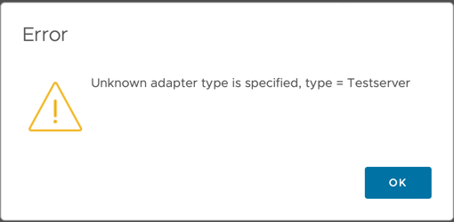

Troubleshooting & FAQ 
==========================

### When starting Docker, I get 'Permission denied while trying to connect to the Docker daemon'

If you're having trouble getting Docker to run on your system, you can refer to the Docker documentation for instructions
on how to start Docker on [macOS](https://docs.docker.com/docker-for-mac/install/), [Linux](https://docs.docker.com/desktop/install/debian/#launch-docker-desktop), and [Windows 10 and 11](https://docs.docker.com/desktop/install/windows-install/#start-docker-desktop).

### When starting Docker on Windows, I get 'Cannot connect to Docker daemon'

If you're having trouble with permissions on a Windows system, you can refer to the Docker documentation for instructions
on how to [Understand permission requirements for Windows](https://docs.docker.com/desktop/windows/permission-requirements/).

### How are docker credential managed?

Docker credential are managed by the Docker daemon. To learn more about how the docker daemon manages credentials
visit the docker [credential store page](https://docs.docker.com/engine/reference/commandline/login/#credentials-store)

### How can I set up an AWS container registry for my project?

AWS container registries use `aws` CLI to authenticate, so users should authenticate to their AWS container registry and create a repository before
running `mp-build`.

1. [Log in to your registry using aws CLI](https://docs.aws.amazon.com/AmazonECR/latest/userguide/getting-started-cli.html#cli-authenticate-registry)
2. [Create a repository](https://docs.aws.amazon.com/AmazonECR/latest/userguide/getting-started-cli.html#cli-create-repository:~:text=your%20default%20registry-,Step%203%3A%20Create%20a%20repository,-Step%204%3A%20Push)
3. Run `mp-build` and use the registry tag when prompted about it (usually looks like `aws_account_id.dkr.ecr.region.amazonaws.com/hello-repository`)

### How can I set up a Docker Hub container registry for my project?

Docker CLI recommends using a token when using docker hub instead of your login password, so users should authenticate their Docker Hub account before running `mp-build`.

1. Generate a [dockerhub token](https://hub.docker.com/settings/security?generateToken=true).
2. Open the `config.json` file in the project's root directory, then replace the key-value of `docker_registry` with the tag of
   the Docker Hub repository prepended with `docker.io`. For example, if the docker tag is `username/docker-registry-test:tagname`
   then the key-value will be `docker.io/username/docker-registry-test`.

VMware Aria Operations only supports anonymous pulling of images, which may cause issues when using Docker Hub since there is a [Donwload rate limit](https://docs.docker.com/docker-hub/download-rate-limit/#:~:text=Docker%20Hub%20limits%20the%20number,pulls%20per%206%20hour%20period).

### How can I set up a Management Pack that uses a private container registry?

VMware Aria Operations only supports anonymous pulling of images, however, cloud proxies lookup images locally before attempting to pull.

1. ssh into the cloud proxy where the adapter is going to be set up
2. pull the same image used by the management pack (usually using the docker CLI inside the adapter)
3. Install Management Pack in VMware Aria operations

### How can I change the container registry for my project?

Open the `config.json` file located in the project's root directory, then replace the key-value for `docker_registry` with the tag of the
repository you want to use. The next time `mp-build` is run, the new tag will be used and validated.

###  Where are the adapter logs stored locally?

Logs generated by `mp-test` or `mp-build` are stored in the `logs` sub-directory of the
project.

###  Where are the adapter logs stored in VMware Aria Operations?

Logs are generated and stored on the cloud proxy where the adapter is running at `$ALIVE_BASE/user/log/adapter/<ADAPTERKEY>_adapter3/<ADAPTER_INTERNAL_INSTANCE_ID>`.

`ADAPTERKEY` should match the adapter key used in the `manifest.txt`, and the `ADAPTER_INTERNAL_INSTANCE_ID` should match the Internal ID
found in VMware Aria Operations at **Environment &rarr; Inventory &rarr; Adapter Instances &rarr; &lt;ADAPTER_DISPLAY_NAME&gt; &rarr; &lt;ADAPTER_INSTANCE&gt;** in the rightmost column.
The `Internal ID` column is not displayed by default. To display the Internal ID, enable the `Internal ID` column by clicking the lower left 'column' icon and then checking the `Internal ID` box.


### What are the different log files used for?

There are five types of log files: adapter, server, build, test, and validation logs. Each log file is prepended with the type of
log file followed by a number that represents rollover.

- `server.log`:
  Contains all logs related to the HTTP server inside the container. Server logs can't be modified since the server code comes packaged
  inside the [base-adapter](https://projects.registry.vmware.com/harbor/projects/46752/repositories/base-adapter/artifacts-tab) Python image.

- `adapter.log`
  Contains all logs related to the adapter. Adapter logs are all the logs generated by adapter code (e.g., the test() method or the collect() methods inside
  `app/adapter.py`).

- `test.log`
  Contains all logs related to `mp-test`.

- `build.log`
  Contains all logs related to `mp-build`.

- `validation.log`
  Contains a log of the validations performed by `mp-test` on the collection results. Validation logs are only generated locally.

###  How do I add logs to my adapter?


The template adapter defines a logger variable in the `adapter.py` file that configures all adapter logging using [adapter_logging](https://github.com/vmware/vmware-aria-operations-integration-sdk/blob/299ce55ac0b1e53dde9c1b4b3e217ab41df57299/lib/python/src/aria/ops/adapter_logging.py) from the Python SDK.
The logger only needs to be configured once; to generate logs in other files, simply import the Python [logging](https://docs.python.org/3/library/logging.html) module. Eg.

  ```python
  import logging

  logger = logging.getLogger(__name__)

  def my_method():
    logger.info("info log")
    logger.warning("warning log")
    logger.error("error log")
    logger.debug("debug log")
     ...
  ```


###  How do I change the server and/or adapter log level?

You can set the log levels for the server and adapter inside the `loglevels.cfg` file, which is located in `logs/loglevels.cfg` locally and on the cloud proxy at `$ALIVE_BASE/user/log/adapters/<ADAPTERKEY>_adapter3/<ADAPTER_INTERNAL_INSTANCE_ID>/loglevels.cfg`.
If the file does not exist, the system generates it after a collection/test.

`ADAPTERKEY` should match the name of the adapter used in the `manifest.txt`, and the `ADAPTER_INTERNAL_INSTANCE_ID` should match the Internal ID
found in VMware Aria Operations at **Environment &rarr; Inventory &rarr; Adapter Instances &rarr; &lt;ADAPTER_DISPLAY_NAME&gt; &rarr; &lt;ADAPTER_INSTANCE&gt;** in the rightmost column.
The `Internal ID` column is not displayed by default. To display the Internal ID, enable the `Internal ID` column by clicking the lower left 'column' icon and then checking the `Internal ID` box.


###  How do I change the log level of mp-init, mp-test, or mp-build?

All SDK tools read the LOG_LEVEL environment variable to set the log level of their console output. For example, to set log level
to debug to see a verbose output of the any of the CLI tools we can set the LOG_LEVEL variable:

For Linux and macOS
  ```shell
  LOG_LEVEL=debug mp-build
  ```
For Windows
  ```
  set LOG_LEVEL=debug
  mp-build
  ```
For Windows, set the log level back to `info` after debugging.

The SDK CLI tools support `debug`, `warn`, `info`, and `error` levels.

### Collection returns '500 INTERNAL SERVER ERROR'

Internal server errors can happen for various reasons; however, the most common cause is an unhandled exception or syntax error in
the adapter's code. Check the server logs for clues about the issue. Sometimes, the problem may be detected using `mp-test` and
going over the terminal output.

### Collection returns 'No collection result was found'

`mp-test` runs a series of validations test after collection; if the collection has no results, then each validation step will report the result as missing.
When a collection result is missing, it usually means an error occurred during collection, but the Adapter handled the error. When the Adapter handles an error,
the response contains an error message; The console displays the error message. For example:

  ```python
  def collect(adapter_instance: AdapterInstance) -> CollectResult:
    result = CollectResult()
    try:
      raise Exception("oops")

      #...
    except Exception as e:
      logger.error("Unexpected collection error")
      logger.exception(e)
      result.with_error("Unexpected collection error: " + repr(e))
      return result
  ```

This code will output

  ```
  Building adapter [Finished]
  Waiting for adapter to start [Finished]
  Running Collect [Finished]
  Collection Failed: Unexpected collection error: Exception('oops')

  Avg CPU %                     | Avg Memory Usage %         | Memory Limit | Network I/O         | Block I/O
  ------------------------------+----------------------------+--------------+---------------------+--------------
  21.1 % (0.0% / 21.1% / 42.2%) | 4.0 % (4.0% / 4.0% / 4.0%) | 1.0 GiB      | 3.24 KiB / 6.67 KiB | 0.0 B / 0.0 B

  Collection completed in 0.45 seconds.

  No collection result was found.
  No collection result was found.
  All validation logs written to '/Users/user/management-pack/test-management-pack/logs/validation.log'
  ```
As seen above, the Exception is mentioned as the reason for the collection error, and the `No collection result was found` message is also shown.
Using the collection error message along with the `adapter.log` can help trace the cause of the issue.

### mp-build returns 'Unable to build pak file'

In most cases, this error indicates issues with building the container image. The most probable causes are:

1. Unknown Instruction :

  ```
  mp-build
  Building adapter [Finished]
  Unable to build pak file
  ERROR: Unable to build Docker file at /Users/user/code/aria_ops/management-packs/test:
   {'message': 'dockerfile parse error line 7: unknown instruction: COP'}

  ```
2. A command  inside the Dockerfile failed:

  ```
  mp-build
  Building adapter [Finished]
  Unable to build pak file
  ERROR: Unable to build Docker file at /Users/user/code/management-packs/test:
   The command '/bin/sh -c pip3 install -r adapter_requirements.txt --upgrade' returned a non-zero code: 1
  ```
The solution for case 1 to fix the typo/command by editing the Dockerfile. For case 2, however, the solution might not be evident at first sight. Since the error
comes from building the image itself, we can run `docker build .` in the project's root directory and look at the stack trace for clues.


### VMware Aria Operations returns 'Unknown adapter type' when setting up new adapter instance


> Example of an 'Unknown Adapter Type' error message for an adapter with type/key 'Testserver'.
If the pak file installs successfully but errors when creating an account (adapter instance), check that:
- The Collector/Group the MP is running on is a Cloud Proxy, and
- Check that the Cloud Proxy supports containerized adapters. Containerized adapter
  support is supported in VMware Aria Operations version 8.10.0 and later.

### How can I implement Policy and Capacity models? 

Policy and capacity models can only be specified by writing a `describe.xml` file in the `conf` directory.

### Are there replacements for  `onConfigure`, `onStopCollection`, and `onDiscard` methods?

The `onConfigure`, `onStopCollection`, and `onDiscard` methods are have no replacement in the new integration SDK. 

### Is there a way to cache data for subsequent collections?

The containerized adapter does not support caching data between collections.

### Can I implement on-demand collections?

The containerized adapter does not support on-demand collections.

### I don't see an answer to my issue

If the none of the above resolve your issue, please open a `Q & A` discussion on the
[GitHub Discussions page](https://github.com/vmware/vmware-aria-operations-integration-sdk/discussions)
that describes the issue you are having.

You can also submit a new bug report issue [here](https://github.com/vmware/vmware-aria-operations-integration-sdk/issues/new?assignees=&labels=bug&template=bug-report.yml),
but we recommend opening a discussion first.