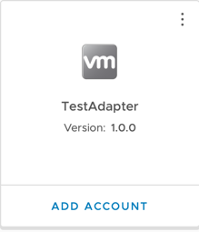
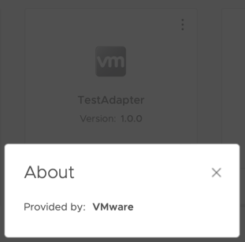
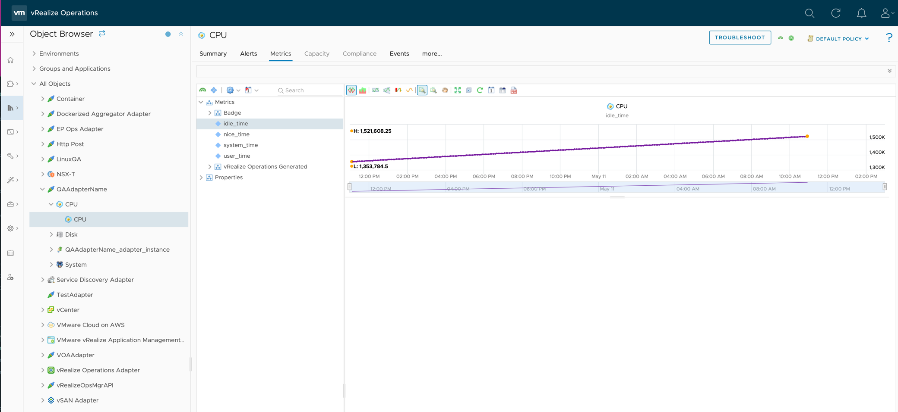

# Get Started

This guide will walk through setting up the SDK and using the SDK
to create, test, and install a simple Management Pack (integration) in VMware Aria Operations.

### Requirements

#### Operating System:
The VMware Aria Operations Integration SDK has been tested on the following operating systems:

* Windows 10
* Windows 11
* macOS 12 (Monterey)
* macOS 13 (Ventura)
* Debian Linux
* Fedora Linux

Other operating systems may be compatible.

#### VMware Aria Operations
The Management Packs generated by the VMware Aria Operations Integration SDK will only run on versions that support containerized Management Packs. Currently, this is limited to on-prem installs, version 8.10 or later.
In addition, at least one Cloud Proxy (also version 8.10 or later) must be set up in VMware Aria Operations, as containerized Management Packs must be run on a Cloud Proxy collector.

#### Dependencies

* Docker 20.10.0 or later. Updating to the latest stable version is recommended. For instructions on installing Docker,
  go to [Docker's installation documentation](https://docs.docker.com/engine/install/),
  follow the instructions provided for your operating system. Finally, make sure the Docker default socket is enabled in the
  **Advanced** tab in **Settings** (version 4.18.0 and above).
* Container registry with read and write access (see [FAQ and Troubleshooting](troubleshooting_and_faq.md#why-do-i-need-a-container-registry) for additional information).
* Python3 3.9.0 or later. Updating to the latest stable version is recommended. Python 3.8 and earlier (including Python2) are not supported. For instructions on installing Python, go
  to [Python's installation documentation](https://wiki.python.org/moin/BeginnersGuide/Download),
  and follow the instructions provided for your operating system.
* Pipx (recommended) or pip. If Python3 is installed, pip is most likely also installed.
  For instructions on installing pipx, go to [pipx's installation documentation](https://pypa.github.io/pipx/installation/), and follow the instructions provided.
  For instructions on installing pip, go to [pip's installation documentation](https://pip.pypa.io/en/stable/installation/), and follow the instructions provided.
* Git 2.35.0 or later. Updating to the latest stable version is recommended.
  For instructions in installing git, go to [Git's installation documentation](https://git-scm.com/downloads),
  and follow the instructions provided for your operating system.

### Installation

To install the SDK, use `pipx` to install into an isolated environment. We recommend this in most cases to avoid dependency conflicts. Alternatively, `pip` can be used to install into the global environment, or to install into a manually-managed virtual environment.
```sh
pipx install vmware-aria-operations-integration-sdk
```

### Creating a Management Pack
After the SDK is installed, create a new project, by running `mp-init`. This tool asks a series of questions that guide
the creation of a new management pack project.


1. `Enter a directory to create the project in. This is the directory where adapter code, metadata, and content will reside. If the directory doesn't already exist, it will be created. Path:`

     The path can be an absolute or relative path. The path should end in an empty or non-existing directory.
     If the directory does not exist, it will be created. This directory will contain a new Management Pack project.

2. `Management Pack display name`

     The Management Pack display name will show up in VMware Aria Operations (**Data Sources &rarr; Integrations &rarr;
     Repository**), or when adding an account.

     

     *This Management Pack's display name is 'TestAdapter', and uses the default icon*

3. `Management Pack adapter key`

     This field is used internally to identify the Management Pack and Adapter Kind. By default, it is set to the
     Management Pack display name with special characters and whitespace stripped from it.

4. `Management Pack description`

     This field should describe what the Management Pack will do or monitor.

5. `Management Pack vendor`

     The vendor field shows up in the UI under 'About' on the Integration Card.

     

     *This Management Pack's vendor is 'VMware'*

6. `Enter a path to a EULA text file, or leave blank for no EULA`

     VMware Aria Operations requires a EULA file to be present in a Management Pack. If one isn't provided, a stub EULA file (`eula.txt` in
     the root project directory) will be added to the project which reads:
      ```
      There is no EULA associated with this Management Pack.
      ```

7. `Enter a path to the Management Pack icon file, or leave blank for no icon`

     The icon is used in the VMware Aria Operations UI if present. If it is not present, a default icon will be used. The icon file must be
     PNG format and 256x256 pixels. An icon file can be added later by copying the icon to the root project directory and
     setting the value of the `"pak_icon"` key to the icon's file name in the `manifest.txt` file.

8. `Select a template for your project`

     Both of the available options will generate a project structure that can be modified into an adapter:

     `Sample Adapter`: Creates a template adapter that collects several objects and metrics from the container the adapter is running.
      The template adapter has comments throughout its code that explain what the code does and how to customize it for your adapter.

     `New Adapter`: Creates methods, minimal comments, and code necessary to implement test
      connection, collection, adapter definition, and endpoints logic.

???+ note

     If you are following along the *Get Started*, select **Sample Adapter**.
     For complete documentation of the `mp-init` tool, including an overview of its output,
     see the [MP Initialization Tool Documentation](references/mp-init.md).

### Project Templates
Both templates create a file system that has the basic project structure required to develop and build a Management Pack.
Each file and directory is discussed in depth in the [mp-init](references/mp-init.md) documentation. `app/adapter.py` is the adapter's
entry point and the best starting point. 

The methods inside `adapter.py` are required, and should be modified to generate a custom
adapter. Each method fulfills a request from the VMware Aria Operations collector, and can be tested individually using
`mp-test` (covered in [Testing a Management Pack](#testing-a-management-pack)).

The adapter is stateless. This means the adapter cannot store any data for use in later method calls.

Each method is described below:

- test(adapter_instance):
  Performs a test connection using the information given to the adapter_instance to verify the adapter instance has been configured properly.
  A typical test connection will generally consist of:

    1. Read identifier values from adapter_instance that are required to connect to the target(s)
    2. Connect to the target(s), and retrieve some sample data
    3. If any of the above failed, return an error, otherwise pass.
    4. Disconnect cleanly from the target (ensure this happens even if an error occurs)

- get_endpoints(adapter_instance):
  This method is run before the 'test' method, and VMware Aria Operations will use
  the results to extract a certificate from each URL. If the certificate is not trusted by
  the VMware Aria Operations Trust Store, the user will be prompted to either accept or reject
  the certificate. If it is accepted, the certificate will be added to the AdapterInstance
  object that is passed to the 'test' and 'collect' methods. Any certificate that is
  encountered in those methods should then be validated against the certificate(s)
  in the AdapterInstance. This method will only work against HTTPS endpoints, different types
  of endpoint will not work (e.g., database connections).

- collect(adapter_instance):
  Performs a collection against the target host. A typical collection will generally consist of:
    1. Read identifier values from adapter_instance that are required to connect to the target(s)
    2. Connect to the target(s), and retrieve data
    3. Add the data into the CollectResult as objects, properties, metrics, etc
    4. Disconnect cleanly from the target (ensure this happens even if an error occurs)
    5. Return the CollectResult.

- get_adapter_definition():
  Optional method that defines the Adapter Instance configuration. The Adapter Instance
  configuration is the set of parameters and credentials used to connect to the target and
  configure the adapter. It also defines the object types and attribute types present in a
  collection. Setting these helps VMware Aria Operations to validate, process, and display
  the data correctly. If this method is omitted, a `describe.xml` file should be manually
  created inside the `conf` directory with the same data. Generally, this is only necessary
  when using advanced features of the `describe.xml` file that are not present in this method.


For further guidance on using the sample adapter, consult the `Guides` section.

### Testing a Management Pack

In the Management Pack directory, the installation script writes a `requirements.txt` file containing the version of the
SDK used to generate the project, and installs the SDK into a virtual environment named `venv`. Note that the packages
in `requirements.txt` are _not_ installed into the adapter. To add a package to the adapter, specify it in the file
`adapter_requirements.txt`.

To use the SDK, navigate to the newly-generated project directory and activate the virtual environment:

For Mac and Linux:
```sh
source venv/bin/activate
```
(This script is written for the bash shell. If you use the csh or fish shells, there are alternate activate.csh and activate.fish scripts you should use instead.)
For Windows:
```cmd
venv\Scripts\activate.bat
```
???+ note

    To exit the virtual environment, run `deactivate` in the virtual environment.

To test a project, run `mp-test` in the virtual environment.

If `mp-test` is run from anywhere outside the root project directory, the tool will prompt to choose a project, and will
test the selected project. If the tool is run from a project directory, the tool will automatically test that project.

`mp-test` will ask for a _connection_. No connections should exist, so choose **New Connection**. The test tool then
reads the `conf/describe.xml` file to find the connection parameters and credentials required for a connection, and
prompts for each. This is similar to creating a new _Adapter Instance_ in the VMware Aria Operations UI. Connections are automatically
saved per project, and can be reused when re-running the `mp-test` tool.

???+ note

    In the sample adapter, the only connection parameter is `ID`, and because it connects to the container it is running on,
    this parameter is not necessary; it is only there as an example, and can be set to any value. The template also implements an
    example Test Connection. If a Test Connection is run (see below), with the `ID` set to the text `bad`, then the Test Connection
    will fail.

The test tool also asks for the method to test. There are four options:

* Test Connection - This call tests the connection and returns either an error message if the connection failed, or an
  empty json object if the connection succeeded.
* Collect - This call test the collection, and returns objects, metrics, properties, events, and relationships.
* Endpoint URLs - This returns a list (possibly empty) of URLs that have distinct SSL certificates that VMware Aria Operations can ask
  the end user to import into the TrustStore.
* Version - This returns
  the [VMware Aria Operations Collector API](https://github.com/vmware/vmware-aria-operations-integration-sdk/blob/main/vmware_aria_operations_integration_sdk/api/vmware-aria-operations-collector-fwk2.json) version the
  adapter implements. The implementation of this method is not generally handled by the developer.

For more information on these endpoints, see
the [Swagger API documentation](https://github.com/vmware/vmware-aria-operations-integration-sdk/blob/main/vmware_aria_operations_integration_sdk/api/vmware-aria-operations-collector-fwk2.json). Each
response is validated against the API.

For complete documentation of the `mp-test` tool see the [MP Test Tool Documentation](references/mp-test.md).

### Building and Installing a Management Pack
To build a project, run `mp-build` in the virtual environment.

If `mp-build` is run from anywhere outside the root project directory, the tool will prompt to choose a project, and will
build the selected project. If the tool is run from a project directory, the tool will automatically build that
project.

Once the project is selected (if necessary), the tool will build the management pack and emit a `pak` file which can be
installed on VMware Aria Operations. The `pak` file will be located in `<project root>/build/` .

To install the `pak` file, in VMware Aria Operations navigate to **Data Sources &rarr; Integrations &rarr;
Repository** and click `ADD`. Select and upload the generated `pak` file, accept the README, and install the management pack.

To configure the management pack, VMware Aria Operations navigate to **Data Sources &rarr; Integrations &rarr;
Accounts** and click `ADD ACCOUNT`. Select the newly-installed management pack and configure the required fields. For
`Collector/Group`, make sure that a cloud proxy collector is selected. Click `VALIDATE CONNECTION` to test the connection.
It should return successfully, then click `ADD`.

By default, a collection will run every 5 minutes. The first collection should happen immediately. However, newly-created
objects cannot have metrics, properties, and events added to them. After the second collection, approximately five
minutes later, the objects' metrics, properties, and events should appear. These can be checked by navigating to
**Environment &rarr; Object Browser &rarr; All Objects** and expanding the Adapter and associated object types and object.


*The CPU object's `idle-time` metric in a Management Pack named `QAAdapterName`.*

For complete documentation of the `mp-build` tool see the [MP Build Tool Documentation](references/mp-build.md).

