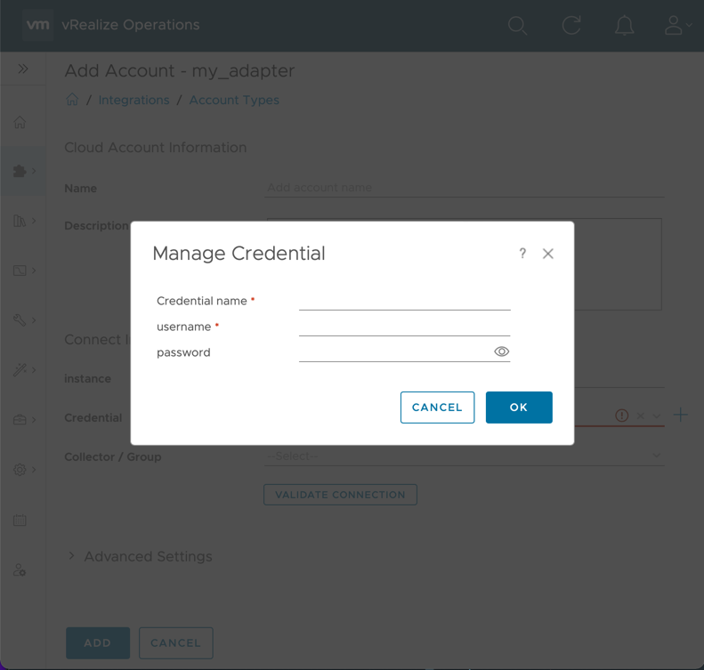
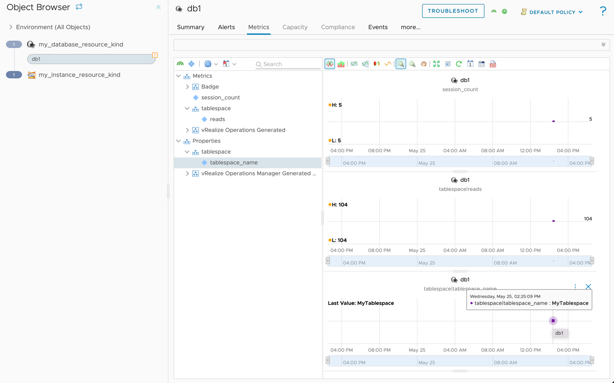

Adding to an Adapter
====================

## Object Model

### What is the Object Model?
At runtime, Aria Operations Manager creates objects representing data sources in the adapter. Every adapter must include
an object model that provides object types, object properties, and semantic definitions describing resources and the
metric data's meaning. The object model can be defined by using a `describe.xml` file, which should be defined in the
`conf` directory,
or it can be defined using the Integration SDK Library
by returning an `AdapterDefinition` object from the **Get Adapter Definition** method.


???+ info "references"

    - [Python Integration SDK Library](../references/python-lib/adapter_instance.md).
    - [Java Integration SDK Library](../references/java-lib/index.html).

### describe.xml vs. AdapterDefinition
When running `mp-build`, `mp-test collect `, or `mp-test test` they call the **Get Adapter Definition** method 
and then generate `describe.xml` file with the `AdapterDefinition` object.
If a `describe.xml` file is present in the `conf` directory, the **Get Adapter Definition** method is not called.

## Defining an Adapter and Adapter Instance in the Object Model
To define an adapter in the `conf/describe.xml` file use the top-level `AdapterKind` XML element. Only one adapter can be
defined in the [object model](#defining-an-adapter-and-adapter-instance-in-the-object-model). The `key` will be used
when creating objects (See [Creating an object](#creating-an-object)), and must also be present in the `manifest.txt`
file in the `"adapter_kinds"` array. When defining an adapter, we also have to define an adapter instance type. An adapter
instance is a special object in VMware Aria Operations that stores user configuration for a connection. Every adapter
must have exactly one adapter instance type.
The Adapter instance type is set by defining a `ResourceKind` XML element with
attribute `type=7`.
When using an Integration SDK Library, we can use the `AdapterDefinition` object.

???+ info "references"

    - Python [AdapterDefinition](../references/python-lib/definition/adapter_definition.md) object.
    - Java [AdapterDefinition](../references/java-lib/-adapter-library/com.vmware.aria.operations.definition/-adapter-definition/index.html) object.
    - describe.xml [documentation](https://github.com/vmware/vmware-aria-operations-integration-sdk/blob/22d90c1e25a65678b172a95aa1b5507e3d400eed/samples/snmp-sample-mp/conf/describeSchema.xsd).

=== "Python Adapter Library"

    ``` python linenums="1"
    def get_adapter_definition() -> AdapterDefinition:
       definition = AdapterDefinition("MyAdapter", "My Adapter")
       return definition
    ```

=== "Java Adapter Library"

    ``` java linenums="1"
    public AdapterDefinition getAdapterDefinition(){
       AdapterDefinition definition = new AdapterDefinition("MyAdapter", "My Adapter");
       return definition;
    }
    ```

=== "describe.xml"

    ``` xml linenums="1"
    <AdapterKind key="MyAdapter" nameKey="1" version="1" >
        <CredentialKinds/>
        <ResourceKinds>
            <ResourceKind key="MyAdapter_adapter_instance" nameKey="2" type="7" credentialKind=""/>
        </ResourceKinds>
    </AdapterKind>
    ```
    

Once an adapter instance is defined, any configuration fields (`ResourceIdentifier` element) and credentials (`CredentialKind` element)
will be prompted to the user when creating an account in VMware Aria Operations on the `Data Sources` &rarr; `Integrations`
page (See [Adding a Configuration Field to an Adapter Instance](#adding-a-configuration-field-to-an-adapter-instance-in-the-object-model
)
and [Adding a Credential](#defining-a-credential-in-the-object-model
). After the account has been created, configuration fields will be
available in the input to the **Collect**, **Test**, and **Get Endpoint** methods.
(See [Creating an Adapter Instance](#creating-an-adapter-instance).)

## Adding a Configuration Field to an Adapter Instance in the Object Model
Adapter instance _identifiers_ distinguish between adapter instances from the same adapter. They also allow for user configuration.
In the `describe.xml` adapter instance identifiers can have an `identType` of `1` or `2`. A type of `1` means the
identifier will be used for determining uniqueness, and will show up by default on the configuration page. If the type
is `2`, the identifier is _non-identifying_, and will show up under the 'advanced' section of the configuration page.
The `Parameter`object has an `advanced` property that determines identType.

???+ info "references"

    - Python [Parameter](../references/python-lib/definition/parameter.md) object.
    - Java [Parameter](../references/java-lib/-adapter-library/com.vmware.aria.operations.definition/-parameter/index.html) object.
    - describe.xml [documentation](https://github.com/vmware/vmware-aria-operations-integration-sdk/blob/22d90c1e25a65678b172a95aa1b5507e3d400eed/samples/snmp-sample-mp/conf/describeSchema.xsd).

=== "Python Adapter Library"

    ``` python linenums="1"
      def get_adapter_definition() -> AdapterDefinition:
          definition = AdapterDefinition("MyAdapter", "My Adapter")

          definition.define_string_parameter(
              "instance",
              label="Instance",
              required=True,
          )
          definition.define_enum_parameter(
              "ssl_mode",
              values= ["Disable", "Require"],
              label="SSL",
              default="Require",
              advanced=True,
          )
          definition.define_int_parameter(
              "max_events",
              label="Max Events",
              advanced=True,
          )
          return definition
    ```

=== "Java Adapter Library"

    ``` java linenums="1"
    public AdapterDefinition getAdapterDefinition(){
          AdapterDefinition definition = new AdapterDefinition("MyAdapter", "My Adapter");

          definition.defineStringParameter(
              "instance", 
              "Instance",
              null, 
              null, 
              512,
              True,
          );

          definition.defineEnumParameter(
                "ssl_mode",
                Arrays.asList(
                        new EnumParameter.EnumValue("Disable"),
                        new EnumParameter.EnumValue("Require")
                ),
                "SSL",
                null,
                "Require",
                true,
                true
          );

          definition.defineIntegerParameter(
              "max_events",
              "Max Events",
              null,
              null,  
              true,
              true
          );
          return definition;
    }
    ```

=== "describe.xml"

      ``` xml linenums="1"
      <AdapterKind xmlns="http://schemas.vmware.com/vcops/schema" key="My Adapter" nameKey="1" version="1">
        <ResourceKinds>
          <ResourceKind key="MyAdapter" nameKey="5" type="7" >
              <ResourceIdentifier dispOrder="1" key="instance" nameKey="6" required="true" type="string" identType="1"/>
              <ResourceIdentifier dispOrder="2" key="ssl_mode" nameKey="7" required="true" type="string" identType="2" enum="true">
                  <enum default="false" value="Disable" />
                  <enum default="true" value="Require" />
              </ResourceIdentifier>
              <ResourceIdentifier dispOrder="3" key="max_events" nameKey="8" required="false" type="integer" identType="2"/>
          </ResourceKind>
        </ResourceKinds>
        <!-- ... -->
      </AdapterKind>
      ```

> 
>
> Creating an account from the above xml (plus a credential). `ssl_mode` and `max_events` have an identType of 2, so they are present in 'Advanced Settings'.

> Note: If there are any existing connections used by the [`mp-test`](../references/mp-test.md) tool before resource identifiers were created or updated, these will need to be deleted or updated.

Once an adapter instance is defined, any configuration fields (`ResourceIdentifier` element) will be prompted to the user when
creating an account in VMware Aria Operations on the `Data Sources` &rarr; `Integrations` page.
After the account has been created, configuration fields will be available to the `AdapterInstance` object passed to the
**Collect**, **Test**, and **Get Endpoints** methods.


## Defining a Credential in the Object Model
In order to connect to most targets, a credential is required. If necessary, an adapter can have multiple different credential kinds.
To add a credential to the Adapter using in the `conf/describe.xml`, add a `CredentialKind` element to `AdapterKind/CredentialKinds`.
The `CredentialKind` element takes one or more `CredentialField` elements which correspond to an individual piece
of data needed for a credential.
We can use the **Define Credential Type** method
to define a new credential type and add it to the `AdapterDefinition` object; then we can specify each credential
field using the returned `CredentialType` object.

???+ info "references"

    - Python:
        - [CredentialType](../references/python-lib/definition/credential_type.md) object. 
        - [Define Credential Type](../references/python-lib/definition/adapter_definition.md#aria.ops.definition.adapter_definition.AdapterDefinition.define_credential_type) method.
    - Java:
        - [CredentialType](../references/java-lib/-adapter-library/com.vmware.aria.operations.definition/-credential-type/index.html) object.
        - [Define Credential Type](../references/java-lib/-adapter-library/com.vmware.aria.operations.definition/-adapter-definition/index.html#1815045111%2FFunctions%2F769193423) method.
    - describe.xml [documentation](https://github.com/vmware/vmware-aria-operations-integration-sdk/blob/22d90c1e25a65678b172a95aa1b5507e3d400eed/samples/snmp-sample-mp/conf/describeSchema.xsd).

A typical credential that requires a username and password might look like this:

=== "Python Adapter Library"

    ```python linenums="1"
    def get_adapter_definition() -> AdapterDefinition:
        definition = AdapterDefinition("MyAdapter", "My Adapter")

        credential = definition.define_credential_type("my_credential_type", "Credential")
        credential.define_string_parameter("user_name", "User Name")
        credential.define_password_parameter("user_password", "Password", required=False)
        return definition
    ```

=== "Java Adapter Library"

    ```java linenums="1"
    public AdapterDefinition getAdapterDefinition() { 
        AdapterDefinition definition = AdapterDefinition("MyAdapter", "My Adapter");

        CredentialType credential = definition.defineCredentialType("my_credential_type", "Credential");
        credential.defineStringParameter("user_name", "User Name");
        credential.definePasswordParameter("user_password", "Password", false);
        return definition;
    }
    ```

=== "describe.xml"

    ```xml linenums="1"
    <AdapterKind xmlns="http://schemas.vmware.com/vcops/schema" key="my_adapter" nameKey="1" version="1">
      <CredentialKinds>
        <CredentialKind key="my_credential_type" nameKey="2" >
          <CredentialField required="true" dispOrder="0" enum="false" key="user_name" nameKey="3" password="false" type="string"/>
          <CredentialField required="false" dispOrder="1" enum="false" key="user_password" nameKey="4" password="true" type="string"/>
        </CredentialKind>
      </CredentialKinds>
      <!-- ... -->
    </AdapterKind>
    ```

    

When defining a credential in `conf/describe.xml` file, it must be added to the Adapter Instance. The adapter
instance is a special `ResourceKind` that is used to configure an adapter. It is marked with the xml attribute/value
`type="7"`. To add the credential to the adapter instance, add an attribute `credentialKind` to the adapter instance's
`ResourceKind` element, with a value of the `CredentialKind`'s `key` attribute.


=== "describe.xml"
```xml linenums="1"
<AdapterKind xmlns="http://schemas.vmware.com/vcops/schema" key="my_adapter" nameKey="1" version="1">
        <!--...-->
    <ResourceKinds>
        <ResourceKind key="my_adapter_instance" credentialKind="my_credential_type" nameKey="5" type="7" >
        <!-- ... -->
    </ResourceKind>
    </ResourceKinds>
</AdapterKind>
```


> 
>
> Adding a credential to an adapter instance with the `username` and `password` fields as defined above. 'Credential name'
> is always added (by VMware Aria Operations), and allows for credentials to be reused between adapter instances.

Both `describe.xml` and `AdapterDefinition` object allow for the use of multiple credential types.

=== "Python Adapter Library"

    ``` python linenums="1"
     def get_adapter_definition() -> AdapterDefinition:
         definition = AdapterDefinition("MyAdapter", "My Adapter")

         # Basic Auth
         basic_auth_credential = definition.define_credential_type("basic_auth_credential", "Basic Auth")
         basic_auth_credential.define_string_parameter("user_name", "User Name")
         basic_auth_credential.define_password_parameter("user_password", "Password", required=False)

         # Token
         token_credential = definition.define_credential_type("token_credential", "Token")
         token_credential.define_password_parameter("token", "Token")

         return definition
    ```

=== "Java Adapter Library"

    ``` java linenums="1"
    public AdapterDefinition getAdapterDefinition() {
        AdapterDefinition definition = AdapterDefinition("MyAdapter", "My Adapter");

        // Basic Auth
        basicAuthCredential = definition.defineCredentialType("basic_auth_credential", "Basic Auth");
        basicAuthCredential.defineStringParameter("user_name", "User Name");
        basicAuthCredential.definePasswordParameter("user_password", "Password", false);

        // Token
        tokenCredential = definition.defineCredentialType("token_credential", "Token");
        tokenCredential.definePasswordParameter("token", "Token");

        return definition;
    }
    ```
    
=== "describe.xml"

    ```xml linenums="1"
    <AdapterKind xmlns="http://schemas.vmware.com/vcops/schema" key="MyAdapter" nameKey="1" version="1">
      <CredentialKinds>
          <CredentialKind key="basic_auth_credential" nameKey="2" >
            <CredentialField required="true" dispOrder="0" enum="false" key="user_name" nameKey="3" password="false" type="string"/>
            <CredentialField required="false" dispOrder="1" enum="false" key="user_password" nameKey="4" password="true" type="string"/>
          </CredentialKind>
          <CredentialKind key="token_credential" nameKey="2" >
              <CredentialField required="true" dispOrder="1" enum="false" key="token" nameKey="4" password="true" type="string"/>
          </CredentialKind>
      </CredentialKinds>
      <ResourceKinds>
          <ResourceKind key="MyAdapter_adapter_instance" nameKey="2" type="7" credentialKind="basic_auth_credential,token_credential"/>
      </ResourceKinds>
    </AdapterKind>
    ```
???+ note

    In the describe.xml credential kind keys are separated by a comma.


Once the credential is defined in the [object model](#defining-an-adapter-and-adapter-instance-in-the-object-model), it can be used in the adapter code.
!!! note

    If there are any existing connections used by the [`mp-test`](../references/mp-test.md) tool before the credential was created
    or updated, these will need to be deleted or updated.

Once an adapter instance is defined, any credential defined in the [object model](#defining-an-adapter-and-adapter-instance-in-the-object-model)
will be prompted to the user when creating an account in VMware Aria Operations on the `Data Sources` &rarr; `Integrations`
page. After the account has been created, credential fields will be available `AdapterInstance` object passed to the
**Collect**, **Test**, and **Get Endpoints** methods.(See [Creating an Adapter Instance](#creating-an-adapter-instance).)


Credentials defined in the object model are available to the `AdapterInstance` object passed to
the **Collect**, **Test**, and **Get Endpoints** methods (See [Creating an Adapter Instance](#creating-an-adapter-instance).).
If an adapter supports multiple credential types, the **Get Credential Type** method can be used to determine the type of the
credential used by the adapter instance.

???+ info "references"

    - Python [Get Credential Type](../references/python-lib/adapter_instance.md#aria.ops.adapter_instance.AdapterInstance.get_credential_type) method.
    - Java [Get Credential Type](../references/java-lib/-adapter-library/com.vmware.aria.operations/-adapter-instance/index.html#1544093356%2FFunctions%2F769193423) method.

## Creating an Adapter Instance
Using any of the Integration SDK Library,
the canonical method for creating an adapter instance is using the `AdapterInstance` object.
Configuration fields and credentials can be accessed using **Get Identifier Value** and **Get Credential Value**,
respectively. 

???+ info "references"

    - Python 
        - [Get Identifier Value](../references/python-lib/object.md#aria.ops.object.Object.get_identifier_value) method.
        - [Get Credential Value](../references/python-lib/adapter_instance.md#aria.ops.adapter_instance.AdapterInstance.get_credential_value) method.
    - Java 
        -  [Get Identifier Value](../references/java-lib/-adapter-library/com.vmware.aria.operations/-adapter-instance/index.html#1966011520%2FFunctions%2F769193423) method.
        -  [Get Credential Value](../references/java-lib/-adapter-library/com.vmware.aria.operations/-adapter-instance/index.html#-1607662015%2FFunctions%2F769193423) method.


=== "Python Adapter Library"

    ```python linenums="1"
    adapter_instance = AdapterInstance.from_input()

    instance = adapter_instance.get_identifier_value("instance")
    ssl_mode = adapter_instance.get_identifier_value("ssl_mode")
    max_events = adapter_instance.get_identifier_value("max_events")

    username = adapter_instance.get_credential_value("username")
    password = adapter_instance.get_credential_value("password")
    ```

=== "Java Adapter Library"

    ```java linenums="1"
    AdapterInstance adapterInstance = AdapterInstance.fromInput();

    String instance = adapterInstance.getIdentifierValue("instance");
    String sslMode = adapterInstance.getIdentifierValue("ssl_mode");
    String maxEvents = adapterInstance.getIdentifierValue("max_events");

    String username = adapterInstance.getCredentialValue("username");
    String password = adapterInstance.getCredentialValue("password");
    ```

!!! note

    the AdapterInstance From Input fuction can only be called once per collection, test connection, or getEndpointURL invocation.

For other languages, or writing an adapter without an Integration SDK Library, JSON representing
the adapter instance is sent to a named pipe. The second-to-last argument the adapter is invoked with will always be the
filename of the named pipe. The adapter instance JSON is described in the
[VMware Aria Operations Collector Framework OpenAPI Document](https://github.com/vmware/vmware-aria-operations-integration-sdk/blob/main/vmware_aria_operations_integration_sdk/api/vmware-aria-operations-collector-fwk2.json).

## Adding an Object Type to the Object Model
An object type is a class of objects (resources) that share the same set of metrics, properties, and identifiers. For
example an adapter might have a 'Database' object kind, and when an adapter instance is created and connects to an
application, several 'database' objects are created representing distinct databases in the application.
To create a new object type in the `conf/describe.xml` file, add a `ResourceKind` element inside `AdapterKind/ResourceKinds`.
A `key` attribute is required, and must be unique among other object types within the `describe.xml` file.
To create a new object type use the **Define Object Type** method of the `AdapterDefinition` object.

???+ info "references"

    - Python 
        - [AdaterDefinition](../references/python-lib/definition/adapter_definition.md) object.
        - [Define Object Type](../references/python-lib/definition/adapter_definition.md#aria.ops.definition.adapter_definition.AdapterDefinition.define_object_type) method.
    - Java
        - [AdapterDefinition](../references/java-lib/-adapter-library/com.vmware.aria.operations.definition/-adapter-definition/index.html) object.
        - [Define Object Type](../references/java-lib/-adapter-library/com.vmware.aria.operations.definition/-adapter-definition/index.html#1246753759%2FFunctions%2F769193423) method.
    - describe.xml [documentation](https://github.com/vmware/vmware-aria-operations-integration-sdk/blob/22d90c1e25a65678b172a95aa1b5507e3d400eed/samples/snmp-sample-mp/conf/describeSchema.xsd).

=== "Python Adapter Library"

    ```python linenums="1"
    def get_adapter_definition() -> AdapterDefinition:
        definition = AdapterDefinition("MyAdapter", "My Adapter")

        definition.define_object_type("my_database_resource_kind", "Database")
        return definition
    ```

=== "Java Adapter Library"

    ```java linenums="1"
    public AdapterDefinition getAdapterDefinition() {
        AdapterDefinition definition = AdapterDefinition("MyAdapter", "My Adapter");

        definition.defineObjectType("my_database_resource_kind", "Database");
        return definition;
    }
    ```
=== "describe.xml"

    ```xml linenums="1"
    <AdapterKind xmlns="http://schemas.vmware.com/vcops/schema" key="MyAdapter" nameKey="1" version="1">
        <!--...-->
      <ResourceKinds>
        <!--...-->
        <ResourceKind key="my_database_resource_kind" nameKey="9"/>
      </ResourceKinds>
    </AdapterKind>
    ```

In addition, an object type may have _identifiers_, which can distinguish between objects of the same type. In the database
example, we may need to know a `port` and `ip address` to uniquely identify each database. If no identifiers are specified,
an object's `name` is used for determining uniqueness. If any identifiers are present (see note), then the `name` is
not used for this purpose.

=== "Python Adapter Library"

    ```python linenums="1"
    def get_adapter_definition() -> AdapterDefinition:
        definition = AdapterDefinition("MyAdapter", "My Adapter")

        data_base = definition.define_object_type("my_database_resource_kind", "Database")
        data_base.define_string_identifier("server_ip", "IP")
        data_base.define_string_identifier("server_port", "Port")
        return definition
    ```
=== "Java Adapter Library"

    ```java linenums="1"
    public AdapterDefinition getAdapterDefinition() {
            AdapterDefinition definition = AdapterDefinition("MyAdapter","My Adapter");

            ObjectType dataBase = definition.defineObjectType("my_database_resource_kind","Database");
            dataBase.defineStringIdentifier("server_ip","IP", true, true, null);
            dataBase.defineStringIdentifier("server_port","Port", true, true, null);
            return definition;
    }
    ```

=== "describe.xml"

    ```xml linenums="1"
    <AdapterKind xmlns="http://schemas.vmware.com/vcops/schema" key="MyAdapter" nameKey="1" version="1">
        <!--...-->
      <ResourceKinds>
        <!--...-->
        <ResourceKind key="my_database_resource_kind" nameKey="9">
            <ResourceIdentifier dispOrder="1" key="server_ip" nameKey="10" required="true" type="string" identType="1"/>
            <ResourceIdentifier dispOrder="2" key="server_port" nameKey="11" required="true" type="integer" identType="1"/>
            <!-- ... -->
        </ResourceKind>
      </ResourceKinds>
    </AdapterKind>
    ```

???+ note

    'ResourceIdentifier' element can have an `identType` of `1` or `2`. A type of `1` is most common, and means the
    identifier will be used for determining uniqueness. If the type is `2`, the identifier is _non-identifying_, and will
    show up in the identifiers of an object but will not cause a new object to be created if it changes. If _all_
    identifiers are non-identifying, then the object's name reverts to determining uniqueness of objects. When using
    the Integration SDK Library, the **Define String Identifier**  methods accepts a parameter for uniqueness.


Once the object type is defined in the [object model](#defining-an-adapter-and-adapter-instance-in-the-object-model),
it can be used in the adapter code. See [Creating an object](#creating-an-object).

## Creating an Object
Before creating an object, ensure that the object type is [present in the object model](#adding-an-object-type-to-the-object-model).

Using an Integration SDK Library,
the canonical method for creating a new object is to use the `CollectResult` object.

???+ info "references" 

    - Python [CollectResult](../references/python-lib/result.md) object.
    - Java [CollectResult](../references/java-lib/-adapter-library/com.vmware.aria.operations/-collect-result/index.html) object.
   
=== "Python Adapter Library"

    ```python linenums="1"
    result = CollectionResult()
    database1 = result.object(adapter_kind="MyAdapter", object_kind="my_database_resource_kind", name="db1",
                              identifiers=[
                                  Identifier("server_ip", "10.0.34.1"),
                                  Identifier("server_port", 110)
                              ])
    # <additional collection code>
    # ...

    # send database1 (and all other objects in the CollectResult) back to VMware Aria Operations
    result.send_result()
    ```

=== "Java Adapter Library"

    ```java linenums="1"
    CollectionResult result = new CollectionResult();
    ObjectType database1 = result.getOrCreateObject("MyAdapter", "my_database_resource_kind", "db1",
                              Arrays.asList( 
                                  new Identifier("server_ip", "10.0.34.1"),
                                  new Identifier("server_port", "110")
                              ));
    // <additional collection code>
    // ...
    
    // send database1 (and all other objects in the CollectResult) back to VMware Aria Operations
    result.sendResults();
    ```

> 
>
> Two objects of type 'my_database_resource_kind'. The creation of the db1 object is shown above. This view is found in `Environment` &rarr; `Inventory`. By default, the identifiers are not shown. They can be enabled by clicking the menu icon in the lower left (not shown in this screenshot) and selecting the _identifier_ columns. Identifiers are ordered in ascending `dispOrder`.-

For other languages, or writing an adapter without an Integration SDK Library, objects must be returned as JSON, described
in
the [VMware Aria Operations Collector Framework OpenAPI Document](https://github.com/vmware/vmware-aria-operations-integration-sdk/blob/main/vmware_aria_operations_integration_sdk/api/vmware-aria-operations-collector-fwk2.json)
.

## Defining an Attribute in the Object Model
An attribute is a class of metrics or properties similar to how an object type is a class of objects. Attributes can be
either a metric or property.

* A metric is numeric data that is useful to track over time. Examples: CPU Utilization (%), Used Disk Space (GB)
* A property is numeric or string data that rarely changes and only the current (last) value is relevant. Examples:
  Operating System Name, CPU Count

???+ note

    Properties should not be used for string data that has a large number of possible values. For example, if you
    want to have a property that shows the last time an operation was run on a server, it is better to convert that
    to a numeric metric such as `hours_since_last_operation`, rather than using a string property with a human-readable
    timestamp, as large numbers of distinct string values can degrade the performance of VMware Aria Operations.

In the `conf/describe.xml` file, attributes can be grouped together in `ResourceGroup` elements, which can be nested.

=== "Python Adapter Library"

    ```python linenums="1"
    def get_adapter_definition() -> AdapterDefinition:
        definition = AdapterDefinition("MyAdapter", "My Adapter")

        data_base = definition.define_object_type("my_database_resource_kind", "Database")
        data_base.define_string_identifier("server_ip", "IP")
        data_base.define_string_identifier("server_port", "Port")

        table_space_group = data_base.define_group("tablespace", "Tablespace")
        table_space_group.define_string_property("tablespace_name", "Name")
        table_space_group.define_metric("reads", "Reads")

        data_base.define_metric("session_count", "Sessions")
        return definition
    ```

=== "Java Adapter Library"

    ```java linenums="1"
    public AdapterDefinition getAdapterDefinition() { 
        AdapterDefinition definition = AdapterDefinition("MyAdapter", "My Adapter");
    
        Object dataBase = definition.getOrCreateObject("my_database_resource_kind", "Database");
        dataBase.defineStringIdentifier("server_ip", "IP");
        dataBase.defineStringIdentifier("server_port", "Port");
    
        Group tableSpaceGroup = dataBase.defineGroup("tablespace", "Tablespace");
        tableSpaceGroup.defineStringProperty("tablespace_name", "Name");
        tableSpaceGroup.defineMetric("reads", "Reads");
    
        dataBase.defineMetric("session_count", "Sessions");
        return definition;
    }
    ```

=== "describe.xml"

    ```xml linenums="1"
    <AdapterKind xmlns="http://schemas.vmware.com/vcops/schema" key="MyAdapter" nameKey="1" version="1">
      <!--...-->
      <ResourceKinds>
        <!--...-->
        <ResourceKind key="my_database_resource_kind" nameKey="9">
          <ResourceIdentifier dispOrder="1" key="server_ip" nameKey="10" required="true" type="string" identType="1"/>
          <ResourceIdentifier dispOrder="2" key="server_port" nameKey="11" required="true" type="integer" identType="1"/>
          <ResourceGroup nameKey="4" key="tablespace">
            <ResourceAttribute nameKey="12" dashboardOrder="1" key="tablespace_name" dataType="string" isProperty="true" />
            <ResourceAttribute nameKey="13" dashboardOrder="2" key="reads" dataType="integer" isProperty="false" />
          </ResourceGroup>
          <ResourceAttribute nameKey="14" dashboardOrder="1" key="session_count" dataType="integer" isProperty="false" />
        </ResourceKind>
      </ResourceKinds>
    </AdapterKind>
    ```

???+ info "references"

    - Python [Define Group](../references/python-lib/definition/group.md#aria.ops.definition.group.GroupType.define_group) method.
    - Java [Define Group](../references/java-lib/-adapter-library/com.vmware.aria.operations.definition/-object-type/index.html#1337075176%2FFunctions%2F769193423) method.
    - describe.xml [documentation](https://github.com/vmware/vmware-aria-operations-integration-sdk/blob/22d90c1e25a65678b172a95aa1b5507e3d400eed/samples/snmp-sample-mp/conf/describeSchema.xsd).


Once an attribute is defined in the [object model](#defining-an-adapter-and-adapter-instance-in-the-object-model), 
it can be used in the adapter code. See [Creating a metric or property](#creating-a-metric-or-property).

## Creating a Metric or Property
Before creating a metric or property, 
ensure that the attribute describing the data is [present in the object model](#defining-an-attribute-in-the-object-model).

When using an Integration SDK Library, metrics and properties can be added using the attribute key and a value.
In the case of attributes in groups, the group key(s) and attribute key are separated by a pipe "|" and
form the metric or property key.

=== "Python Adapter Library"

    ```python linenums="1"
    database1 = # Object
    database1.with_property("tablespace|tablespace_name", "MyTablespace")
    database1.with_metric("tablespace|reads", 104)
    database1.with_metric("session_count", 5)
    ```
=== "Java Adapter Library"

    ```java linenums="1"
    Object database1 = // Object
    database1.withProperty("tablespace|tablespace_name", "MyTablespace");
    database1.withMetric("tablespace|reads", 104);
    database1.withMetric("session_count", 5);
    ```

> 
>
> Result of the above code. Since the numbers and strings are hard-coded, these values will never change.
> For a real adapter, the values will be the result of querying the target for up-to-date information.
> Note that there are a number of automatically generated metrics and properties. The metric groups 'Badge',
> 'VMware Aria Operations Generated', and 'VMware Aria Operations Manager Generated Properties' (and the metrics
> and properties inside) are present on every object.

For other languages, or writing an adapter without an Integration SDK Library, metrics and properties
are returned as JSON inside of objects, described in the
[VMware Aria Operations Collector Framework OpenAPI Document](https://github.com/vmware/vmware-aria-operations-integration-sdk/blob/main/vmware_aria_operations_integration_sdk/api/vmware-aria-operations-collector-fwk2.json).

## Creating an Event
Events do not need to be declared in the [object model](#defining-an-adapter-and-adapter-instance-in-the-object-model) file, and can simply be added to an object at runtime.

Using the [Python Adapter Library](../references/python-lib/adapter_instance.md)
, events are added to resources. The only required parameter is the message, which describes and uniquely identifies the event.

=== "Python Adapter Library"

    ```python linenums="1"
    database1 = # Object
    database1.with_event(
        message="Database read latency is above threshold", criticality=Criticality.IMMEDIATE)
    ```
=== "Java Adapter Library"

    ```java linenums="1"
    Object database1 = // Object
    database1.withEvent(
        "Database read latency is above threshold", Criticality.IMMEDIATE);
    ```

???+ info "references"
   
    - Python [With Event](../references/python-lib/object.md#aria.ops.object.Object.with_event) method.
    - Java [With Event](../references/java-lib/-adapter-library/com.vmware.aria.operations/-object/index.html#1007866879%2FFunctions%2F769193423) method.

> 
>
> Result of the above code. Note that the criticality is affecting the health of the db1 object it is attached to.

For other languages, or writing an adapter without an Integration SDK Library, events are
returned as JSON inside of objects, described in the
[VMware Aria Operations Collector Framework OpenAPI Document](https://github.com/vmware/vmware-aria-operations-integration-sdk/blob/main/vmware_aria_operations_integration_sdk/api/vmware-aria-operations-collector-fwk2.json)
.

## Creating a Relationship
Relationships do not need
to be declared in the [object model](#defining-an-adapter-and-adapter-instance-in-the-object-model) file,
and can simply be added between objects at runtime.
Relationships are always between a _parent_ and _child_, and if object1 is a parent of object2, that implies object2
is a child of object1.

=== "Python Adapter Library"

    ```python linenums="1"
    instance = # Object
    database1 = # Object
    database2 = # Object
    instance.add_child(database1)
    database2.add_parent(instance)
    # database2 and database1 both have the same relationship with respect to the instance object after these calls
    ```

=== "Java Adapter Library"

    ```java linenums="1"
    Object instance = // Object
    Object database1 = // Object
    Object database2 = // Object

    instance.addChild(database1);
    database2.addParent(instance);
    // database2 and database1 both have the same relationship with respect to the instance object after these calls
    ```


> 
>
> Result of the above code. The db1 and db2 objects are both children of the 'instance' object. The health of a child
> object can impact the health of a parent object.
  
???+ warning

     Relationships must not have cycles. A cycle happens when an object's relationships are structured in such a
     way that it is its own descendant (or ancestor).
     For example, the following creates a cycle: 
     
      - object1 parent of object2
      - object2 parent of object3
      - object3 parent of object1  

     Care should be taken to avoid these, as they can adversely affect
     VMware Aria Operations' analytics calculations.

???+ info "references"

    - Python 
        - [Add Child](../references/python-lib/object.md#aria.ops.object.Object.add_child) method.
        - [Add Parent](../references/python-lib/object.md#aria.ops.object.Object.add_parent) method.
    - Java 
        - [Add Child](../references/java-lib/-adapter-library/com.vmware.aria.operations/-object/index.html#-1969626532%2FFunctions%2F769193423) method.
        - [Add Parent](../references/java-lib/-adapter-library/com.vmware.aria.operations/-object/index.html#-1436819358%2FFunctions%2F769193423) method.

For other languages, or writing an adapter without an Integration SDK Library, relationships are returned as JSON inside a
collect result object, described in
the [VMware Aria Operations Collector Framework OpenAPI Document](https://github.com/vmware/vmware-aria-operations-integration-sdk/blob/main/vmware_aria_operations_integration_sdk/api/vmware-aria-operations-collector-fwk2.json)
.
