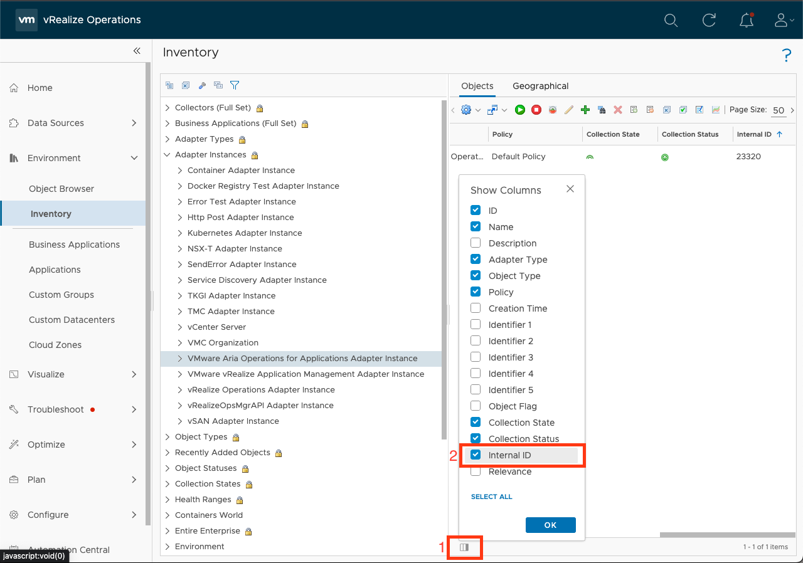
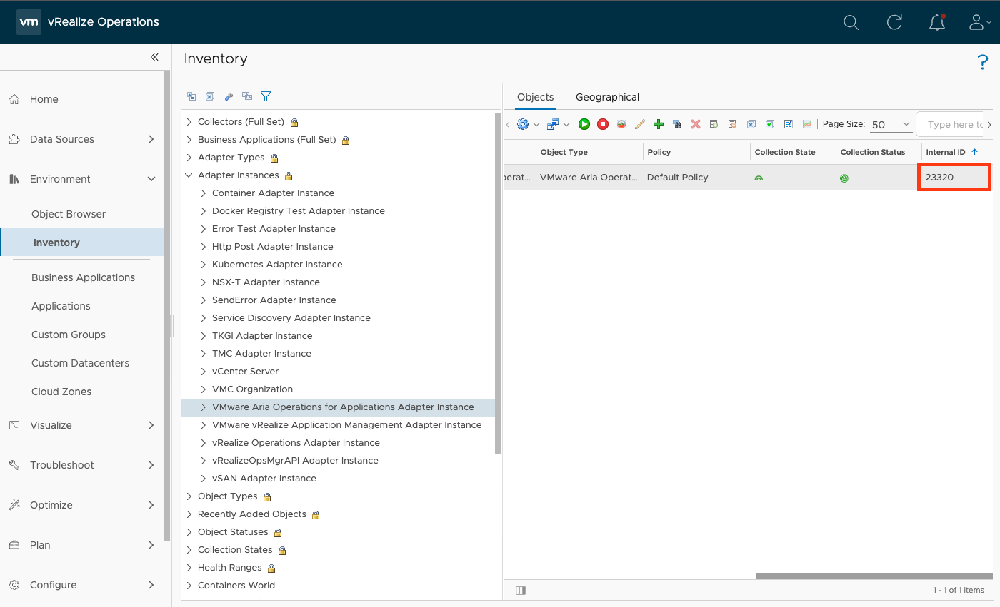

# Logs


###  Where are the adapter logs stored locally?

Logs generated by `mp-test` or `mp-build` are stored in the `logs` subdirectory of the
project.

---
###  Where are the adapter logs stored in VMware Aria Operations?

Logs are generated and stored on the cloud proxy where the adapter is running at 
`$ALIVE_BASE/user/log/adapters/<ADAPTERKEY>/<ADAPTER_INTERNAL_INSTANCE_ID>`.

`ADAPTERKEY` should match the adapter key used in the `manifest.txt`, and the `ADAPTER_INTERNAL_INSTANCE_ID` should
match the Internal ID
found in VMware Aria Operations at **Environment &rarr; Inventory &rarr; Adapter Instances &rarr;
&lt;ADAPTER_DISPLAY_NAME&gt; &rarr; &lt;ADAPTER_INSTANCE&gt;** in the rightmost column.
The `Internal ID` column is not displayed by default. To display the Internal ID, enable the `Internal ID` column by
clicking the lower left 'column' icon and then checking the `Internal ID` box.





---
### What are the different log files used for?

There are five types of log files: adapter, server, build, test, and validation logs.
Each log file is prepended with the type of log file followed by a number that represents rollover.

- `server.log`:
  Contains all logs related to the HTTP server inside the container. Server logs can't be modified since the server code
  comes packaged
  inside
  the [base-adapter](https://projects.packages.broadcom.com/ui/packages/docker:%2F%2Fvmware_aria_operations_integration_sdk%2Fbase-adapter/python-1.0.0?name=base-adapter&type=packages)
  Python image.

- `adapter.log`
  Contains all logs related to the adapter. Adapter logs are all the logs generated by adapter code (e.g., the test()
  method or the collect() methods inside
  `app/adapter.py`).

- `test.log`
  Contains all logs related to `mp-test`.

- `build.log`
  Contains all logs related to `mp-build`.

- `validation.log`
  Contains a log of the validations performed by `mp-test` on the collection results. Validation logs are only generated locally.

---
###  How do I add logs to my adapter?

=== "Python Adapter Library"

    The template adapter defines a logger variable in the `adapter.py` file that configures all adapter logging using 
    [adapter_logging](https://github.com/vmware/vmware-aria-operations-integration-sdk/blob/299ce55ac0b1e53dde9c1b4b3e217ab41df57299/lib/python/src/aria/ops/adapter_logging.py) from the Python SDK.
    The logger only needs to be configured once; to generate logs in other files, simply import the Python [logging](https://docs.python.org/3/library/logging.html) module. Eg.

    ```python linenums="1" hl_lines="3"
    import logging

    logger = logging.getLogger(__name__)

    def my_method():
      logger.info("info log")
      logger.warning("warning log")
      logger.error("error log")
      logger.debug("debug log")
       ...
    ```

=== "Java Adapter Library"

    Adapter logging is setup via the [Setup Logging](../references/java_project/java_lib/com/vmware/aria/operations/AdapterLogger.html#setupLogging(java.lang.String,java.lang.Integer,java.lang.Long)) method
    available through the `AdapterLogger` class of the Java Integrations SDK. The logger only need to be set up once.
    To retrieve the logger, you can call the `Get Logger` static method:

    ```java linenums="1" hl_lines="3"
    import org.apache.logging.log4j.Logger;
    import com.vmware.aria.operations.AdapterLogger;

    public Class Adapter {
      public void myMethod() {
        Logger logger = AdapterLogger.getLogger();
        logger.info("info log");
        logger.warning("warning log");
        logger.error("error log");
        logger.debug("debug log");
      }

      public void myOtherMethod() {
        Logger logger = AdapterLogger.getLogger();
        logger.info("other info log");
        logger.warning("other warning log");
        logger.error("other error log");
        logger.debug("other debug log");
      }

      public static void main(String[] args){
        AdapterLogger.setupLogging("Adapter");
        Adapter instance = new Adapter();
        instance.myMethod();
        instance.myOtherMethhod();
      }
    }
    ```

---
###  How do I change the server and/or adapter log level?

You can set the log levels for the server and adapter inside the `loglevels.cfg` file,
which is located in `logs/loglevels.cfg` locally and on the cloud proxy
at `$ALIVE_BASE/user/log/adapters/<ADAPTERKEY>/<ADAPTER_INTERNAL_INSTANCE_ID>/loglevels.cfg`.
If the file does not exist, the system generates it after a collection/test.

`ADAPTERKEY` should match the name of the adapter used in the `manifest.txt`, and the `ADAPTER_INTERNAL_INSTANCE_ID`
should match the Internal ID
found in VMware Aria Operations at **Environment &rarr; Inventory &rarr; Adapter Instances &rarr;
&lt;ADAPTER_DISPLAY_NAME&gt; &rarr; &lt;ADAPTER_INSTANCE&gt;** in the rightmost column.
The `Internal ID` column is not displayed by default. To display the Internal ID, enable the `Internal ID` column by
clicking the lower left 'column' icon and then checking the `Internal ID` box.


---
###  How do I change the log level of mp-init, mp-test, or mp-build?

All SDK tools read the LOG_LEVEL environment variable to set the log level of their console output.
For example,
to set the log level of any of the CLI tools, we can set the LOG_LEVEL variable to the desired log level:

=== "Linux"

    ```shell
    LOG_LEVEL=debug mp-build
    ```

=== "macOS"

    ```shell
    LOG_LEVEL=debug mp-build
    ```
=== "Windows"

    ```
    set LOG_LEVEL=debug
    mp-build
    ```

    !!! information

        Set the log level back to `info` after debugging.

The SDK CLI tools support `debug`, `warn`, `info`, and `error` levels.
