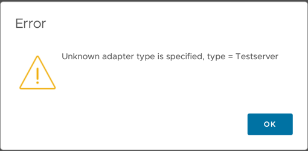

# Other

### How can I implement Policy and Capacity models?

Policy and capacity models can only be specified by writing a `describe.xml` file in the `conf` directory.

### Are there replacements for  `onConfigure`, `onStopCollection`, and `onDiscard` methods?

The `onConfigure`, `onStopCollection`, and `onDiscard` methods have no replacement in the new integration SDK.

### VMware Aria Operations returns 'Unknown adapter type' when setting up new adapter instance

> Example of an 'Unknown Adapter Type' error message for an adapter with type/key 'Testserver'.

If the pak file installs successfully but errors when creating an account (adapter instance), check that:

- The Collector/Group the MP is running on is a Cloud Proxy, and
- Check that the Cloud Proxy supports containerized adapters. Containerized adapter
  support is supported in VMware Aria Operations version 8.10.0 and later.

