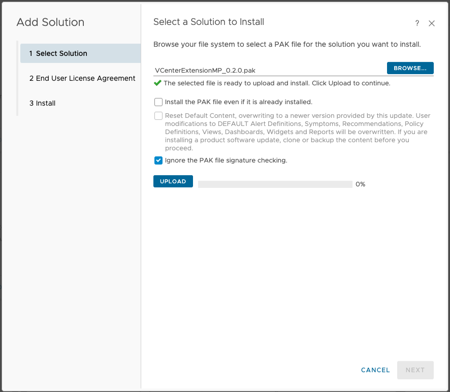
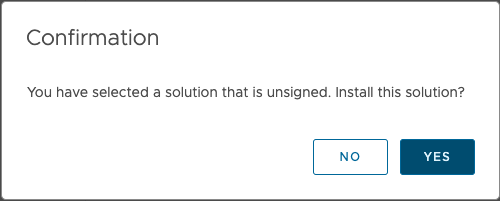
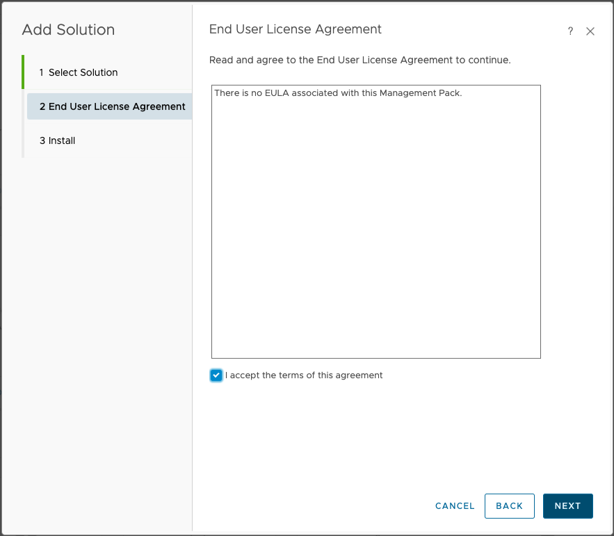
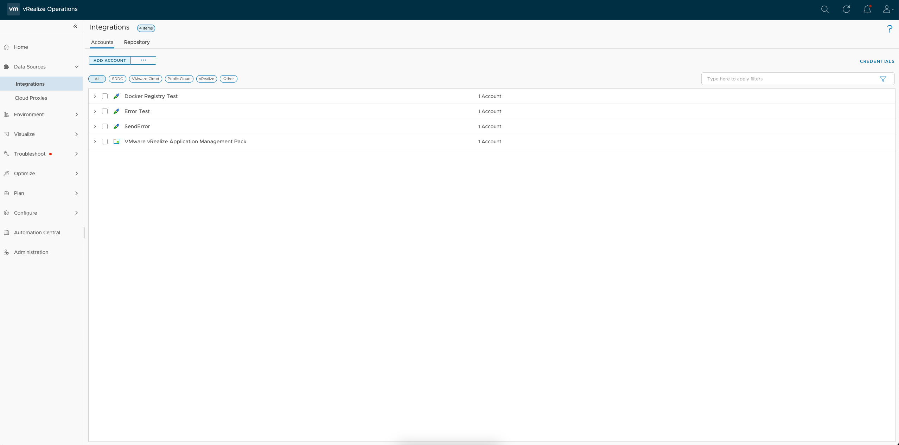
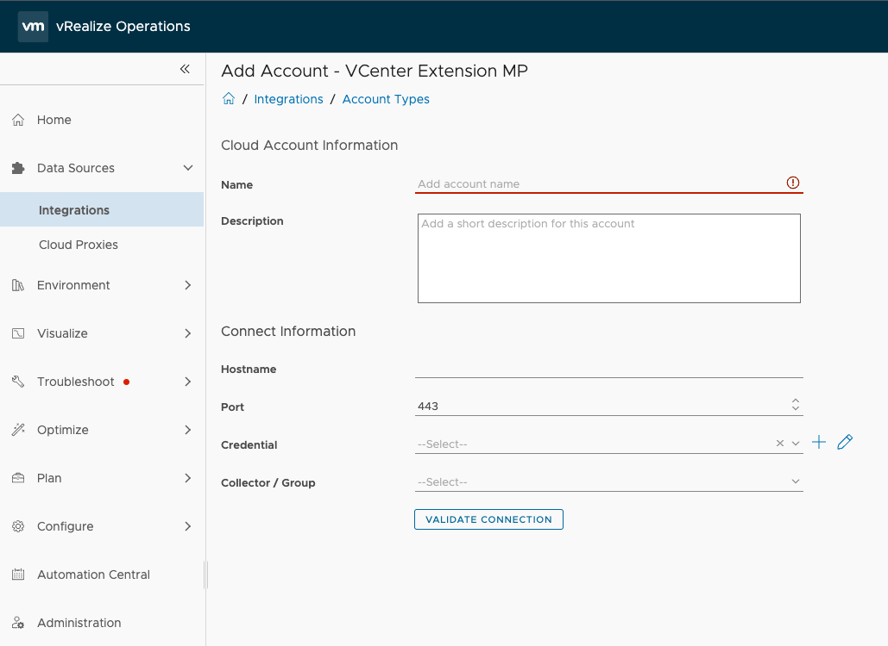

# VMware vCenter MP Extension

## Requirements
- [Integration SDK](../../README.md#Requirements)
- vCenter Adapter Instance on VMware Aria Operations
- Container registry accessible to the cloud proxy where the vCenter MP Extension adapter will run.
  

## Building
### Build pak file
- Run `mp-build` at the root of the sample project directory. `mp-build` uses the given container registry to 
  upload a container image that contains the adapter. The cloud proxy pulls the container image from the registry and
  runs the adapter inside the container. Consult the [Troubleshooting](../../README.md#troubleshooting) section for 
  additional information about setting up container registries.
```shell
> mp-build
Building adapter[Finished]
Waiting for adapter to start [Finished]
Adding describe fragment to describe.xml: ...
mp-build needs to configure a container registry to store the adapter container image.
Enter the tag for the container registry: [PATH_TO_CONTAINER_REGISTRY]/vcenterextensionmp
```
### Install Management Pack on VMware Aria Operations
- Go to  **Integrations &rarr; Repository &rarr; ADD**.
- Select the pak file located in the `build` directory at the root of the sample project directory, then go through the prompts and wait for the installation to complete.
- Check **ignore the PAK file signature checking** and then press **UPLOAD**
  
- After the pak file finishes uploading, press **NEXT** and then press **YES** when the pop-up appears
 
  
 
- Accept the license agreement
 
  

- Wait for the solution to install
### Configure Adapter
- Go to  **Integrations &rarr; ADD ACCOUNT**.
 
  

- Select VCenter Extension MP
  When adding an account, the 'Hostname' parameter must be identical to the 'vCenter Server' parameter on the adapter instance it is extending.
 
  

- Validate Connection and Add Account
